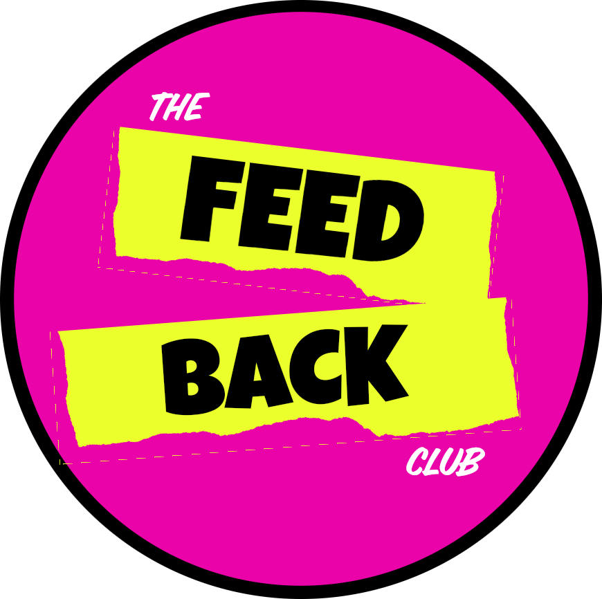

Delivering a good Tech talk is hard. There are many things to consider. Most tech talk speakers I meet are not professional speakers. They do this as a hobby. The basic process to improve is to keep doing the tech talks and watching how audiences respond and trying again. Sometimes we get feedback mostly this feedback is after the talk or not very useful. There is another skill we could practise. This is the skill of *giving* feedback and also the skill of *receiving* feedback. If we all practise our feedback skills we can help each other give better tech talks.

To crowd source a place where we can practise our feedback skills I am starting the **The Tech Talk Feedback Club** or just **The Feedback Club** for short. This is a safe space to ask for feedback and to practise giving feedback. Here are some rules of engagement:

* you do not need to be an experienced speaker to give feedback, all you need to do is pay attention and give your honest opinion on how you understand what the speaker is communicating
* the more you give the more you get, so engage
* give feedback on the topic, the talk, the delivery NOT the person
* giving feedback is a gift of time, we are grateful for the input
* if someone gives feedback, the speaker/author can choose to ignore the feedback
* The Feedback Club is a safe space
* Use the appropriate channels to ask
* Say clearly if you have a deadline, but remember we are all volunteers

Here are some resources to give and receive feedback:

* [How to master the art of feedback](https://play.acast.com/s/amazingif/howtomastertheartoffeedback) podcast 22min
* [Thanks for the Feedback](https://www.amazon.com/Thanks-Feedback-Science-Receiving-Well-ebook/dp/B00F10Z4GO?crid=GXZKMY77YQOJ&keywords=Thanks+for+the+feedback+book&qid=1699585336&sprefix=thanks+for+the+feedback+book,aps,319&sr=8-1) book
* [Giving Feedback](https://www.mindtools.com/a18a0wu/giving-feedback) article with pointers

We will add more in the resources slack channel

The Tech Talk Feedback Club is a slack community. If you would like to join in, contact the person who told you about the club to give you the invite link.

Welcome to The Tech Talk Feedback Club.

