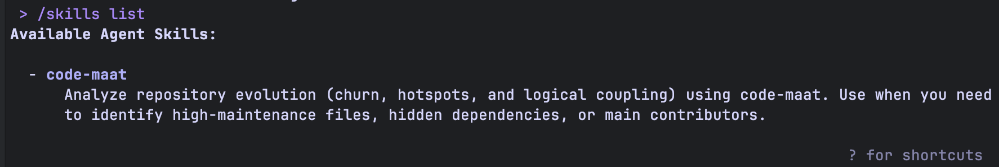
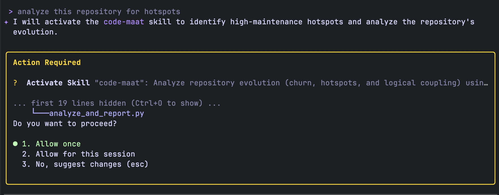
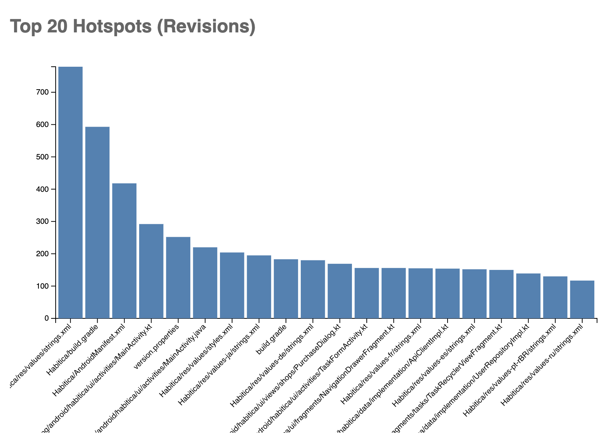
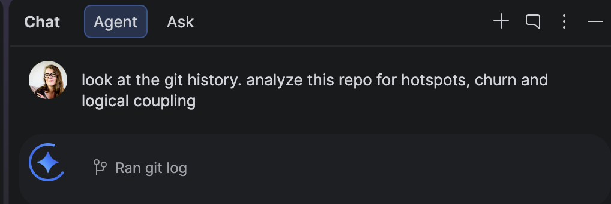
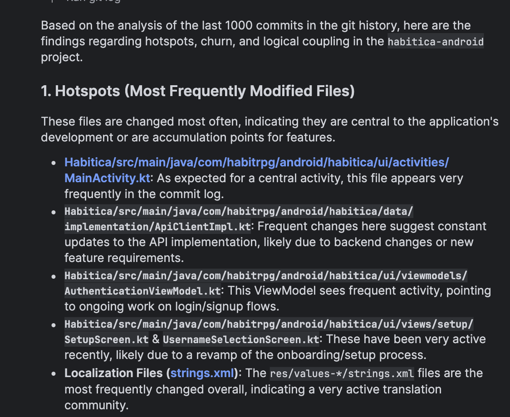
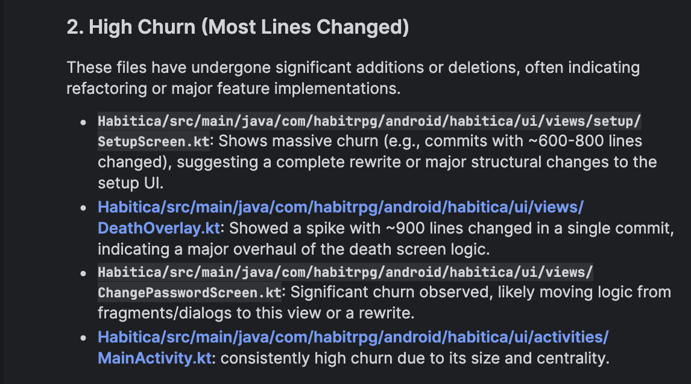
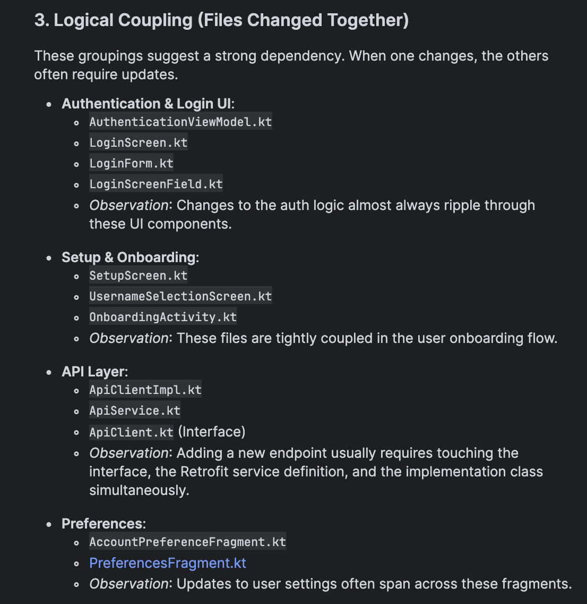
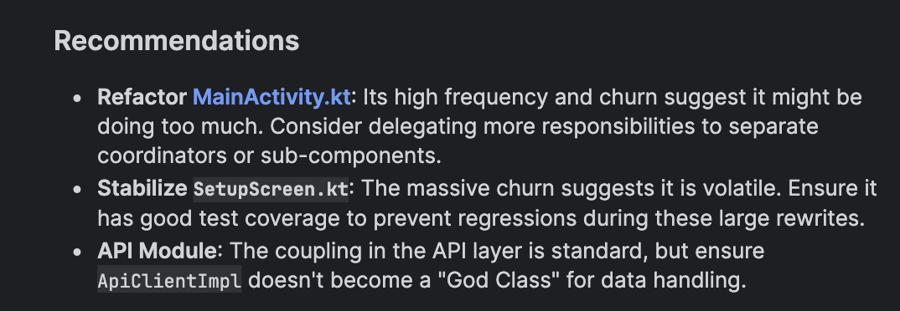
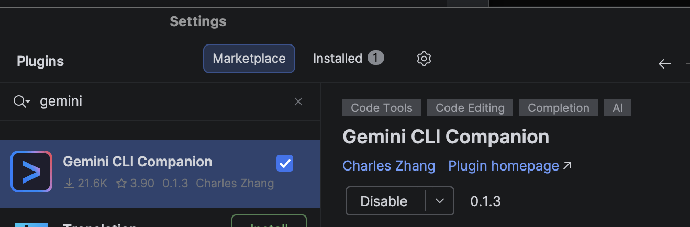
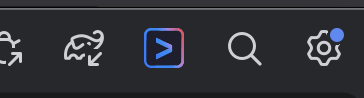

## Introduction

What AI tools work for building Android apps? I am exploring some variations. In this post I will look at *Gemini CLI*, tech debt detection with a skill using Code Maat and how this compares with the Agent of Gemini in Android Studio.

I am not starting with a new project. What if you have an *existing codebase* and you want to find the best place to tackle some *tech debt* that will make a difference for everyone. The sample codebase is the [Habitica app](https://github.com/HabitRPG/habitica-android), which had its first commit in 2015. Rather than poking at the code in a random or an **"intuitive"** way or asking the AI questions, let's look at a more deterministic way to answer this question. Or rather, let's teach the agent to use some scripts to answer this question. The benefit of packaging this functionality in a skill is that you can create this specialisation and script usage in a skill that will be loaded lazily only when you need it.

## The theory - Code as Crime scene

Adam Tornhill wrote a book, [Your Code as a Crime Scene](https://www.adamtornhill.com/articles/crimescene/codeascrimescene.htm), that uses your git history and applies forensic science to figure out where the hotspots, logical coupling, churn and more can be found in your code base. He has a java tool called Code Maat that you can use to analyse this information. The problem is, it is a bit finicky to setup and run and I can never remember all the command line parameters for git or for the tool. The theory TLDR is if you can see which large files change often or which files always change together, you can see which parts of your code are brittle or are coupled. The added benefit is that this analysis is language neutral. So if you build an agent skill for this, it can be used on any codebase.

## Creating the Code Maat Skill

### What do we need

* the [link to Code Maat](https://github.com/adamtornhill/code-maat)
* optionally [download](https://github.com/adamtornhill/code-maat/releases) the code-maat standalone jar and put it in `~/tools/code-maat.jar` to speed up the first run
* [Gemini CLI](https://geminicli.com/docs/get-started/installation/) + [authentication and API key if you have it](https://geminicli.com/docs/get-started/authentication/)
* the `skill-creator` skill - this is part of the Gemini CLI install
* the [Habitica Android app repo](https://github.com/HabitRPG/habitica-android) to test on
* the prompt

Here is the prompt I used:
```
I need you to create a new Gemini CLI agent skill called "code-maat" using the skill-creator. The skill is based on
  the code-maat tool (https://github.com/adamtornhill/code-maat).

  Core Intent
  Analyze repository evolution (churn, hotspots, and logical coupling). The skill must automate the extraction of git
  logs, run the Clojure-based analysis, and produce both a human-readable report and an interactive D3.js visualization.


  🔍 Discovery Phase (Crucial)
  Before writing the Python orchestrator, you MUST:
   1. Run java -jar ~/tools/code-maat.jar --help to verify available analysis types.
   2. Run a sample of each analysis (summary, revisions, authors, coupling) against the current repository and inspect
      the CSV headers.
   3. Note that code-maat often uses hyphens (e.g., n-revs, n-authors, average-revs) rather than underscores. Ensure
      your Python script maps these exactly.


  Implementation Details
   4. Environment Checks:
      - Verify Git and Java (version 8+) are in the PATH.
      - Check for ~/tools/code-maat.jar. If missing, provide the download link and stop.
      - Ensure the current directory is a Git repository.
   5. Log Extraction:
      - Generate the log using: git log --all --numstat --date=short --pretty=format:'--%h--%ad--%aN' > log.txt.
   6. Analysis Logic & Schema Safety:
      - Create a Python orchestrator in scripts/analyze_and_report.py.
      - Requirement: The script must use csv.DictReader and include a safety check to verify that expected keys
        (identified in the Discovery phase) exist in the output before processing.
      - Map the following analyses:
        - summary (Stats)
        - revisions (Hotspots: expect entity, n-revs)
        - authors (Main devs: expect entity, n-authors, n-revs)
        - coupling (Logical coupling: expect entity, coupled, degree, average-revs)
   7. Reporting & Visualization:
      - Generate a REPORT.md summarizing the top 10 findings for each category.
      - Create an HTML/D3 template in assets/viz_template.html. The Python script should inject the JSON-formatted
        analysis data into this template.

  Skill Structure
   - Logic in scripts/.
   - D3 template in assets/.
   - Metric explanations in references/README.md.


  Validation
   1. Functional Test: Execute the script on the current repository.
   2. Data Integrity: Verify that REPORT.md is actually populated with data (not just headers) and that no KeyError
      exceptions occur during parsing.
   3. Documentation: Ensure SKILL.md defines the usage clearly.
```

### Steps

1. Open a terminal and type `gemini`. I did this in the repo, but anywhere will do.
2. Paste in the above prompt
3. Let it run, check what it is doing and accept.
4. Let it install the skill for you. I chose a user wide installation which will put this skill into `~/.gemini/skills`
5. Test the skill in a fresh session with gemini with a prompt something like this `tell me about the hotspots in this codebase` Sometimes it messes up the skill scripts but will fix any issues it has on the first run.

### What did it do

It creates a set of scripts, templates and prompts to be able to generate a git log of your project and then feed it to the code-maat java tool. This tool in turn provides results for the hotspot and churn questions. The skill has some protection built in so that it won't run on a non-git repo and it will check if you have everything installed. It will write a summary in a report and create an HTML visualisation. Once it is complete and installed you should see it in your gemini session with the command `/skills list`


## The proof is in the pudding - where are the hotspots?

### Taking the code-maat skill for a spin

This is what the `analyze this repo for hotspots` prompt produced


It should figure out from that prompt that it needs to use the `code-maat` skill and generate a report for you in the code-maat folder. Here is what it found for the Habitica repo.

```
The analysis of the Habitica Android repository reveals the following hotspots and areas of high
  maintenance:


  🛠️ Key Hotspots (Highest Revision Frequency)
   - Habitica/res/values/strings.xml (779 revisions, 42 authors): The most volatile file, driven by constant
     feature additions and internationalization updates.
   - Habitica/build.gradle (593 revisions): Indicates frequent dependency management and build configuration
     shifts.
   - Habitica/src/main/java/com/habitrpg/android/habitica/ui/activities/MainActivity.kt (292 revisions): A
     central logic hub for the UI, likely a candidate for further architectural decomposition.
   - Habitica/AndroidManifest.xml (418 revisions): Frequent updates to app components and permissions.


  👥 Collaboration Hotspots (High Author Count)
   - Localization Files: Many authors contribute to strings.xml across various languages (Spanish, French,
     German, Russian, etc.), reflecting a strong community contribution model.


  🔗 Logical Coupling (Hidden Dependencies)
   - Task Adapters: There is 100% logical coupling between DailiesRecyclerViewHolder.kt,
     TodosRecyclerViewAdapter.kt, and HabitsRecyclerViewAdapter.kt. Changes to one almost always require
     changes to the others, suggesting shared logic that could be abstracted.
   - WearOS Layouts: Similar tight coupling exists in the WearOS module for row_daily.xml, row_todo.xml, and
     row_habit.xml.
   - Item Cards: daily_item_card.xml and todo_item_card.xml are highly coupled (85%), indicating mirrored UI
     changes.


  The full report is available in code-maat/REPORT.md and a D3 visualization has been generated at
  code-maat/visualization.html.
```

The first thing to notice is that it doesn't know about Android things. `strings.xml` does change a lot and lots of people change this file but that's ok. `build.gradle` changes could be an indication that something can be improved but then again it could just be dependencies updates. Likewise, I'm not sure why the AndroidManifest.xml changed so much. However the big MainActivity.kt could be something to look at.

More interesting for me though is the *logical coupling* between those RecyclerViewAdapters. I would probably look at how to clean that part of the code and possibly convert it to compose.

The skill has a way to generate visualisations too. They aren't as sophisticated as the paid-for tool. In the next iteration it would be possible to prompt Gemini CLI for more detailed/clear visualisations.


### What does the Gemini in Android Studio Agent say?



And here the results









What is immediately obvious is that Gemini in Android Studio agent is more aware of how Android projects are put together. It also identifies the `MainActivity.kt` as an area to improve but knows that the `strings.xml` needs to change for all copy or translations. The results seem better but they may vary every time you run the prompt. The code-maat skill results should be repeatable because they are a result of the scripts which generate the csv reports even though the AI interpretation of the results could vary.

## Which one should I use?

### Gemini CLI

This is a good choice if you want to be able to run the agent in a sandbox environment. Also good if you like the CLI environment or you need to spawn multiple agents each doing many things. The underlying models are the same as Gemini in Android Studio and both have the same  context window if the same models are used, but the system prompt differs. The integration into Android Studio is sparse: a button to open the terminal and a way to share a file and line number. Gemini CLI can be expanded easily with extensions.

### Gemini in Android Studio - agent

The main benefit of using the Agent in Android Studio is it has system prompts that ground it in Android documentation and better IDE integration. This means the results are tailored for Android code bases. The downside is that you can't run multiple agents.

## Next steps

### Fix something

Given that we now know what we can refactor in the codebase, the next step would be to use either tool and make a plan to clear up some of the tech debt.

### Build more skills

Identify more skills to build and use the `skill-creator` to expand Gemini CLI or build some rules in Gemini in Android Studio for tasks you do regularly. This will allow you to enhance your Android AI use with knowledge specific to the tasks you do regularly.

## Extra goodies

While there are a myriad of MCP services available both in Android Studio as part of the AI configuration in settings and as Gemini CLI extensions, I would be selective with the ones I install. If there are too many to choose from it causes noise in the context and the results are not as good. Given the choice, I would prefer skills over MCP tools.

### Managing Extensions
   * Search: Browse the [Gemini CLI Extension Gallery](https://geminicli.com/extensions/) or use the
     `/extensions explore` command in an interactive session to open it in your browser.
   * Install: Use the terminal command gemini extensions install <github-url-or-path>. (Note: This must be
     done from your standard terminal, not inside the CLI's interactive mode).
   * List: Run /extensions list within the CLI to see active extensions or gemini extensions list in your
     terminal.

### One Gemini CLI plugin for android





This can be found in the marketplace and is useful to get rudimentary integration if you choose to use this tool above the built-in Agent.

### ADB connections in Gemini CLI
A useful extension for Android development in Gemini CLI is `adb-control-gemini` installed with this command

`gemini extensions install https://github.com/tiendung2k03/adb-control-gemini`

To use it, prompt like this:
`inspect the ui on the running emulator` or `start the emulator xxx and run the app on the emulator` You may need to make sure that adb is in your path.

And that's it for now, this is already a long read.
