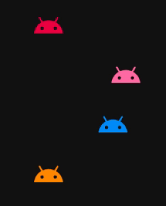
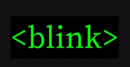
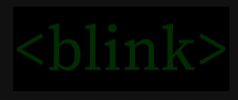

Another  small experiment to explore Jetpack Compose animations. I came to the conclusion that any value that is passed as a parameter could be animated, including anything in the modifier. So I set out to build a `<blink>` tag. 

My first attempt creates a composable function that takes the modifier, animates it and passes it back to the content lambda. Like this:

```kotlin
@Composable
fun BlinkTag(
    modifier: Modifier = Modifier,
    durationMillis: Int = 500,
    content: @Composable (modifier: Modifier) -> Unit
) {
    val infiniteTransition = rememberInfiniteTransition()
    val alpha: Float by infiniteTransition.animateFloat(
        initialValue = 1f,
        targetValue = 0f,
        animationSpec = infiniteRepeatable(
            animation = tween(durationMillis = durationMillis),
            repeatMode = RepeatMode.Reverse
        )
    )
    content(modifier = modifier.alpha(alpha))
}
```

When you use it you get a modifier back which you then pass to your content.
```kotlin
BlinkTag 
    Row {
        Icon(
            modifier = it, // <- like so
            tint = RainbowRed,
            painter = painterResource(id = R.drawable.ic_android_black_24dp),
            contentDescription = null // decorative element
        )
        Text(
            text = "blinky",
            color = RainbowRed,
            modifier = it.padding(8.dp) // <- and here too
        )
    }
}
```



The animation for this was a linear `tween()` between invisible and visible. However anyone who [knows the blink tag](https://www.google.com/search?q=blink+tag) will realise that it stays on longer than off. It blips off and then comes back on again staying visible for longer. 

To do this I replaced the `tween()` with `keyframes`:
```kotlin
@Composable
fun BlinkTag(
    modifier: Modifier = Modifier,
    duration: Int = 500,
    content: @Composable (modifier: Modifier) -> Unit
) {
    val infiniteTransition = rememberInfiniteTransition()
    val alpha: Float by infiniteTransition.animateFloat(
        initialValue = 1f,
        targetValue = 0f,
        animationSpec = infiniteRepeatable(
            animation = keyframes {
                durationMillis = duration
                1f at (duration*0.8).toInt() // we started at 1 and stay here for 80% of the time
                0f at duration // then drop down to 0 in the last 20% of the time
            },
            repeatMode = RepeatMode.Reverse 
        )
    )
    content(modifier = modifier.alpha(alpha))
}
```




Reading the [material theme docs](https://developer.android.com/jetpack/compose/themes#emphasis) I found out there was another way to share alpha values to a children in the composable tree using a [LocalContentAlpha](https://developer.android.com/reference/kotlin/androidx/compose/material/package-summary#LocalContentAlpha). This mechanims is used for emphasis using alpha and I am pretty sure the intention isn't for this to be used to make layouts blink. I am doing this for science.

```kotlin
@Composable
fun LocalContentBlinkTag(
    durationMillis: Int = 500,
    content: @Composable () -> Unit
) {
    val infiniteTransition = rememberInfiniteTransition()
    val alpha: Float by infiniteTransition.animateFloat(
        initialValue = 1f,
        targetValue = 0f,
        animationSpec = infiniteRepeatable(
            animation = tween(durationMillis = durationMillis),
            repeatMode = RepeatMode.Reverse
        )
    )
    CompositionLocalProvider(LocalContentAlpha provides alpha) {
        content()
    }
}
```

When using this blink tag you no longer need to pass down the modifier since the changing alpha value is available to the children in a `CompositionLocal` 

Use it like this:
```kotlin
LocalContentBlinkTag {
    Row {
        Icon(
            painter = painterResource(id = R.drawable.ic_android_black_24dp),
            contentDescription = null // decorative element
        )
        Text(text = "<blink>")
    }
}
```



Although I defintely don't support the irresponsible use of the blink tag, no investigation of reproducing retro website animations would be complete without a `<blink>` I realised again how powerful yet simple the animation system in Jetpack Compose can be. Be warned.

Find all the source in [this repo](https://github.com/maiatoday/MagicSprinkles)

Also in this series:

[RainbowText]( "Rainbow Text")

[VisitorCounter]( "Visitor Counter")