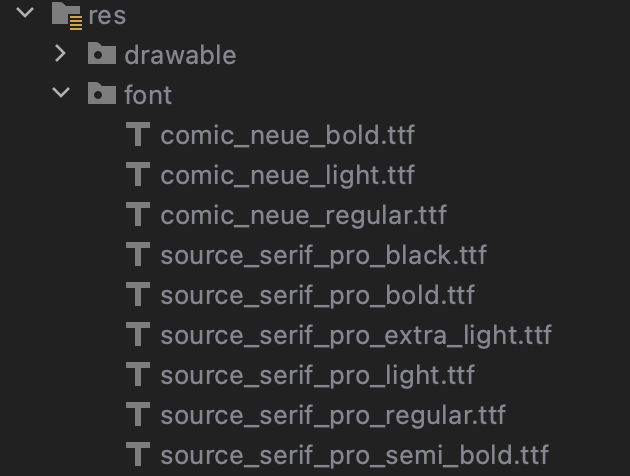
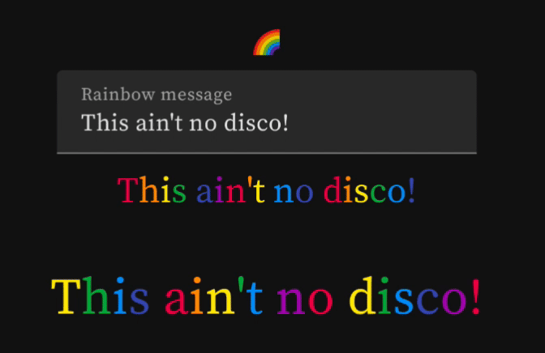

[Do you remember web pages in the nineties?](https://www.wonder-tonic.com/geocitiesizer/) Everything was pulsing, rotating and animating. I am exploring Jetpack Compose animations and I figured if I can reproduce a 90s web page look, I can do anything. Also June is the month of Rainbows. So to kick off this series I am building animating rainbow text.

First I need a rainbow. It needs to be flexible enough for me to be able to swap in any rainbow.
```kotlin
val RainbowRed = Color(0xFFDA034E)
val RainbowOrange = Color(0xFFFF9800)
val RainbowYellow = Color(0xFFFFEB3B)
val RainbowGreen = Color(0xFF4CAF50)
val RainbowBlue = Color(0xFF2196F3)
val RainbowIndigo = Color(0xFF3F51B5)
val RainbowViolet = Color(0xFF9C27B0)

val SkittlesRainbow = listOf(
    RainbowRed,
    RainbowOrange,
    RainbowYellow,
    RainbowGreen,
    RainbowBlue,
    RainbowIndigo,
    RainbowViolet
)
```

Since web pages in the nineties used Times New Roman and Helvetica, I added a free version of a serif font. I chose [Source Serif](https://fonts.google.com/specimen/Source+Serif+Pro?query=source+serif). I included the ttf files in the project and made a FontFamily and hooked this into the theme.



```kotlin
val SourceSerif = FontFamily(
    Font(R.font.source_serif_pro_regular),
    Font(R.font.source_serif_pro_bold, FontWeight.Bold),
    Font(R.font.source_serif_pro_light, FontWeight.Light),
    Font(R.font.source_serif_pro_black, FontWeight.Black),
    Font(R.font.source_serif_pro_extra_light, FontWeight.ExtraLight),
)

val Typography = Typography(defaultFontFamily = SourceSerif)
MaterialTheme(
        colors = colors,
        typography = Typography,
        shapes = Shapes,
        content = content
    )
```

Next I made a composable that would colour each letter of a string. This simple composable took as many text parameters in and then split the string colouring each character to the colour of the rainbow in the parameter. The `startColor` index is used to pick which colour the first letter will be.

```kotlin
@Composable
fun MultiColorText(
    modifier: Modifier = Modifier,
    text: String,
    style: TextStyle = LocalTextStyle.current,
    rainbow: List<Color> = SkittlesRainbow,
    startColor: Int = 0,
) {
    Row(modifier) {
        var index = startColor
        for (letter in text) {
            Text(letter.toString(), color = rainbow.get(index), style = style)
            index++
            if (index == rainbow.size) index = 0
        }
    }
}
```
This allowed me to create a second composable which used an infinite transition to animate continouously. I animate the `startColor` integer and this will recompose the nested `MultiColorText` composable. The `animateValue` will change the value of `colorIndex` over time and will use the `Int.VectorConverter` to get a value between 0 and the size of the rainbow. In this way it creates an endless loop of changing integer values. The animation spec is a simple `tween()` which just changes be*tween* the `initalvalue` and the `targetValue` in alinear way. Different effects can be created by fiddling with the `repeatMode` or the other parameters in the `animationSpec` or adjusting the duration in the `tween()`.

```kotlin
@Composable
fun SnappyRainbowText(
    modifier: Modifier = Modifier,
    text: String,
    style: TextStyle = LocalTextStyle.current,
    rainbow: List<Color> = SkittlesRainbow
) {
    require(rainbow.size > 0)
    val infiniteTransition = rememberInfiniteTransition()
    val colorIndex by infiniteTransition.animateValue(
        initialValue = 0,
        targetValue = rainbow.size - 1,
        typeConverter = Int.VectorConverter,
        animationSpec = infiniteRepeatable(
            animation = tween(),
            repeatMode = RepeatMode.Restart
        )
    )
    MultiColorText(
        text = text,
        style = style,
        modifier = modifier,
        startColor = colorIndex,
        rainbow = rainbow
    )
}
```

I made a simple test screen with an edit text field so I could try it out.



As you can see the animation is uhm ... snappy. If you can't see it, click on the image.

Is it possible to change from one colour to the next smoothly and still have all the letters different colours?

The first step is to create a composable that will cycle through a rainbow of colours. This is done by creating a keyframes animation. The keyframe points are the colours of the rainbow.

```kotlin
@Composable
fun MultiColorSmoothText(
    modifier: Modifier = Modifier,
    text: String,
    style: TextStyle = LocalTextStyle.current,
    rainbow: List<Color> = PastelRainbow,
    startIndex: Int = 0,
    duration: Int
) {
    val infiniteTransition = rememberInfiniteTransition()
    val interval = duration / rainbow.size
    val color by infiniteTransition.animateColor(
        initialValue = rainbow[0],
        targetValue = rainbow.last(),
        animationSpec = infiniteRepeatable(
            animation = keyframes {
                durationMillis = duration
                delayMillis = startIndex * interval / 2
                var i = 0
                // set the keyframes from the rainbow with code
                for (color in rainbow) { // this is the crux  of setting the keyframes
                    color at i // at is an infix method in the KeyframesSpec class
                    i += interval
                }
            },
            repeatMode = RepeatMode.Restart
        )
    )
    Text(text = text, color = color, style = style, modifier = modifier)
}
```

This composable can be used to loop through colours of the rainbow on a Text composable. 


Finally I built a composable that split the string again and made each letter a `MultiColorSmoothText`. It uses the `startIndex` to delay the animation. The effect is that each letter is a different colour.

```kotlin
@Composable
fun SmoothRainbowText(
    modifier: Modifier = Modifier,
    text: String,
    style: TextStyle = LocalTextStyle.current,
    rainbow: List<Color> = PastelRainbow,
    startColor: Int = 0,
    duration: Int = 1200
) {
    Row(modifier) {
        var index = startColor
        for (letter in text) {
            MultiColorSmoothText(
                text = letter.toString(),
                style = style,
                rainbow = rainbow,
                startIndex = index,
                duration = duration
            )
            index++
            if (index == rainbow.size) index = 0
        }
    }
}
```

And the final smooth animating rainbow text using a pastel rainbow.


Next I'll tackle some more retro 90s web page inspired animations, visitor counters, flames, rotating images, shifting tiled backgrounds and walls of text that change size.

Until then... [this ain't not disco](https://youtu.be/_NywTcGOUkE?t=44)

Find all the source in [this repo](https://github.com/maiatoday/MagicSprinkles)
