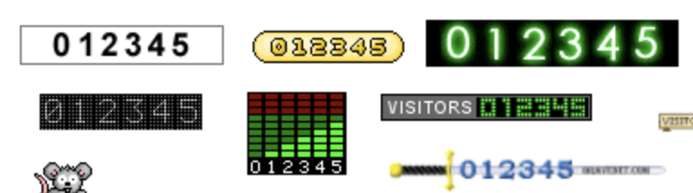
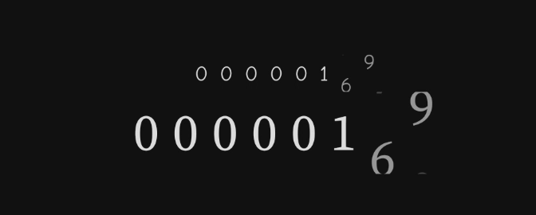
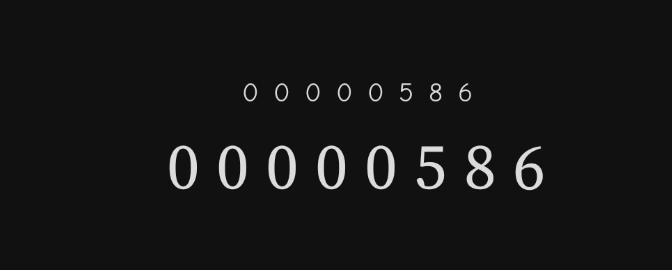

Another step forward in recreating the icon 90s website look is the [hit counter, visitor counter or web counter](https://www.awwwards.com/5-old-school-web-design-trends-nobody-misses.html) in classic squemorphic odometer style.



I was inspired by a recent episode of [Code with Italians](https://youtu.be/zoq1n_0Lkp8?t=5919) where they animated a time field. I wanted to change the counter component to animate each number individually to get that odometer look.

Before doing this though there was a question of ***state***. I wanted to make a counter that would auto increment in a coroutine. It had to change direction up or down if you tapped it. To do this I decided to store the state and the counting direction in a view model. This allowed me to keep the components as stateless as possible. The components are re-usable because the logic that makes the numbers go up or down is held outside of the composable functions.

The [recommendation from Google](https://youtu.be/0z_dwBGQQWQ?t=451) is when you use a view model to hold state, keep it close to the root screen. I made a screen for my visitor counter and added it to my navigation code. Since I already had Hilt enabled in the project it was pretty easy to get hold of the viewmodel. The code snippet in the Navigation looks like this:

```kotlin
NavHost(navController, startDestination = "overview") {
        //... other routes go here
        composable(route = "counter") {
            val viewModel: CounterViewModel = hiltViewModel() //<--- get the viewmodel from Hilt
            val count by viewModel.counter.collectAsState() //<--- the viewmodel exposes the counter as a StateFlow
            CounterScreen(
                count = count,
                onClick = { viewModel.onClick() } // <--- the viewmodel provides a method for when the element is clicked
            )
        }
    }
```

The `CounterScreen` is stateless and gets the value of the counter and the event handler as parameters. The `CounterScreen` has a `Counter` composable. The role of the `Counter` composable is to create a row of individual odometer numbers from the passed values. Also it should intercept a click and call the click handler.

```kotlin
@Composable
fun Counter(
    onClick: () -> Unit,
    count: Int,
    width: Int
) {
    val displayWidth = maxOf(3, width)
    Row(
        modifier = Modifier.clickable(
            interactionSource = remember { MutableInteractionSource() },
            indication = null,
            onClick = onClick
        ),
    ) {
        for (n in displayWidth - 1 downTo 0) { //<--- this loop builds the row based on the number
            CounterCell(
                count = (count.toDouble() / 10.0.pow(n) % 10).toInt(), //<--- split the number in to units, tens, hundreds etc
                width = 1 //<--- set each cell to only be one digit wide
            )
        }
    }
}
```

The actual animation happens in each `CounterCell`. It uses `AnimatedContent` to slide from the top if the new number is more than the previous one and slide from the bottom if the new number is lower than the first.

```kotlin
@Composable
fun CounterCell(
    count: Int,
    width: Int
) {
    val numbersSlidingAnimation: AnimatedContentScope<Int>.() -> ContentTransform = {
        if (initialState > targetState) {
            slideInVertically(initialOffsetY = { it }) + fadeIn() with slideOutVertically(
                targetOffsetY = { -it }) + fadeOut()
        } else {
            slideInVertically(initialOffsetY = { -it }) + fadeIn() with slideOutVertically(
                targetOffsetY = { it }) + fadeOut()
        }
    }
    AnimatedContent(
        targetState = count,
        transitionSpec = numbersSlidingAnimation
    ) { number ->
        Text(text = number.toString().padStart(width, '0'))
    }
}
```

You can see what this looks like in the gifs below.





All that is left to complete this example is the [view model](https://github.com/maiatoday/MagicSprinkles/blob/main/app/src/main/java/net/maiatoday/magicsprinkles/CounterViewModel.kt). 

As you can see from the code by making the composable functions simple and stateless, it is possible to separate the UI requirements from the logic that drives it. This is a useful pattern because it allows the view model to be tested properly. It makes the composables themselves re-usable for different situations. Who knows, you could animate click counts or visitors or changing crypto wallet values all with the same re-usable component.

Find all the source in [this repo](https://github.com/maiatoday/MagicSprinkles)

Also in this series:

[RainbowText]( "Rainbow Text")

[BlinkTag]( "Blink Tag")