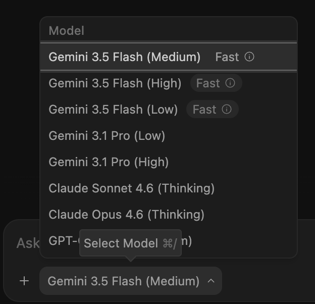
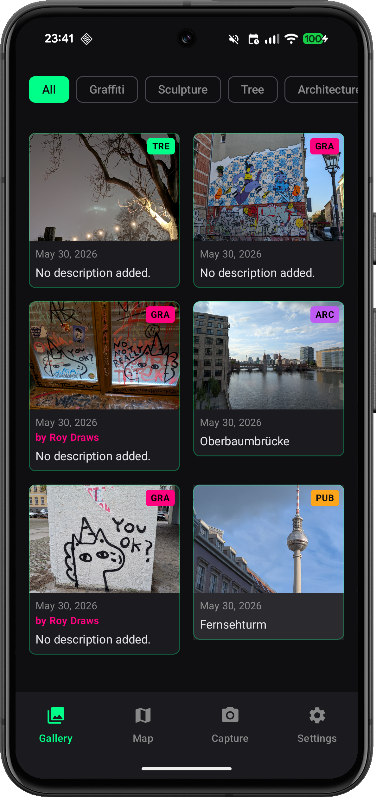
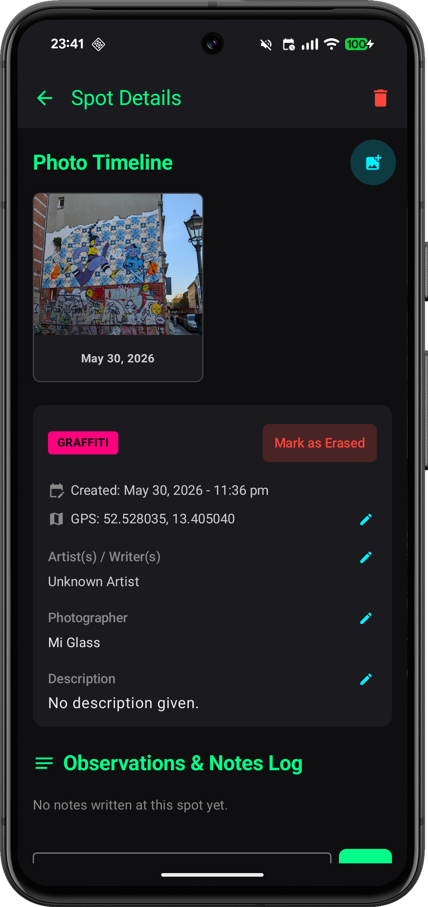
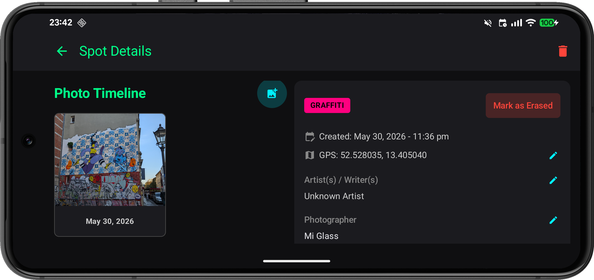

# How does Antigravity and Android Studio work together? What do I do where?

There are as many workflows and preferences as there are Android engineers starting with light mode vs dark mode. This is not an attempt to provoke a holy war. What I have noticed is that in the days BA (Before Agents) I used to open Android Studio and do most things in there, edit, debug, preview, git and do CLI things. Now its not like that anymore.

[Click here](#take-antigravity-20-for-a-spin---build-me-an-app-make-it-not-suck-or-you-go-to-jail--tagspotter) if you want to skip the rant 😤 and just jump to Antigravity experiment

Today in Android Studio I can run 1 agent or 2 if one is on a command line, max 3 if the third is just the Ask/chat tab. Or I can have a ton of terminals open with multiple agents juggling work trees. Or I can use one of the many multi agent solutions like Conductor, Superset or [Antigravity 2.0](https://antigravity.google/download?utm_campaign=deveco_gdemembers&utm_source=deveco) that are popping up like mushrooms.  Then I could open multiple Android Studio versions in the worktrees I spun up with the agents. 

If I am in full agent mode and I just quickly want to edit something, I can do it in a small editor in the orchestrator tool but very soon I miss the creature comforts of Android Studio. But opening multiple instances of Android Studio is super slow (looking at you gradle sync and indexing). If my orchestrator environment is Antigravity 2.0 I can either jump back into Antigravity IDE or open the project in AndroidStudio. 

## The problem

Arrgh so many chat boxes everywhere with agents waiting to eat my tokens! So many tool combos all fighting for RAM and CPU cycles on my machine!

I just want to add a setting to a file, I might as well edit it in **vi**.

## ok deep breath. 

I don't have a solution and I'm sure the internet has many suggestions so let me just figure out whre Antigravity 2.0 shines and what is better to do in Android Studio.

## Use Antigravity
### The mindset - broad, explore, plan, hands off, chatty, parallel work

In Antigravity it is broader picture, start an app. Exploration and planning. Multiple agents doing things in worktrees. Agents are editing. Build with gradle and run on the emulator using `android` command line and skill integration. Agents come first. Less clicking and keyboard shortcuts more human/agent conversations and agent status watching. It can load as much of your codebase into the context as it can find with its tools.

### The downside - no editor, do simple things with chat

You have to type a verbose sentence to change something small in a file. Chances are in future we may forget all those small things and only be able to remember vague verbose sentences anyway.

## Use Android Studio
### The mindset - plumbing, easy code access, logcat, preview, debug, hands in code

In Android Studio you dig into the plumbing. Check crashes. Look at previews. Hand code.  Sure there is Gemini in Android studio in multiple places integrated and ready to chat and act. But you are much closer to putting your hands in the code, literally. The tools in the agents and the integrated skills are very Android aware, grounded in official documentation and understanding the Android studio integration. You tell the agent exactly which files are in the context. It doesn't load your whole project.

### The downside - one instance per worktree, agents everywhere, memory and cpu hog, slow at times

Probably the biggest downside is the wait for the beast to gradle sync and index for every worktree you have open. The AI integrations could feel scattered, with right click options and fix with AI everywhere. Ultimately you only have one agent and one Ask/chat window running, unless you add more in the command line.

## What about Antigravity CLI - `agy` - in Android Studio

You could run `agy` in the terminal in Android Studio. The question is what can you do in `agy` that you can't do in either the Agent or Ask/chat pane? The instance of Android studio is still in one folder ie one worktree. So any multi-agent workflow needs to be able to run in the same folder without interfering with each other.

## Tell me again but in a table

[Click here](#take-antigravity-20-for-a-spin---build-me-an-app-make-it-not-suck-or-you-go-to-jail--tagspotter) if you want to jump ahead to the Antigravity demo part  and skip the AI summary.

🚧 AI generated content ahead
| Comparison Dimension | **Antigravity 2.0** *(Standalone App)* | **Android Studio** *(Traditional IDE)* | **Antigravity CLI** *(Terminal Interface)* |
| :--- | :--- | :--- | :--- |
| **Developer Approach / Mindset** | **The Conductor (Agent-First):** Focuses on orchestrating, planning, and delegating multiple autonomous tasks simultaneously. Developers shift from active coding ("vibecoding") to high-level project management, utilizing a "fire-and-forget" asynchronous workflow. | **The Builder (Code-First):** Human-centric, synchronous, and precise. The developer is deeply involved in writing code line-by-line, manual step-debugging, UI layout tweaking, and micro-managing the deterministic execution of the build system. | **The Speedrunner (Terminal-First):** Lightweight, minimalist, and automation-driven. Favors lightning-fast keyboard execution, text-based repository parsing, and DevOps scripting without the rendering overhead of a graphical UI. |
| **Core Intent / Primary Surface** | Multi-agent orchestration, planning, and asynchronous background execution across multi-repo projects. | Full-suite Android application design, compilation, emulation, profiling, and direct source-code refactoring. | High-velocity command execution, quick script generation, and triggering local agent pipelines from within the terminal. |
| **Key Features** | • Parallel multi-agent execution<br>• Dynamic subagents for focused subtasks<br>• Scheduled/cron automated tasks<br>• Non-blocking asynchronous task management<br>• Multi-repo project grouping<br>• Live voice transcription input | • Native Android Gradle build system<br>• Layout Editor (XML / Jetpack Compose Preview)<br>• Advanced CPU/Memory Profilers<br>• Android Device Emulator<br>• Logcat debugging & APK Analyzer<br>• Deep Git / VCS native integration | • Instant agent instantiation via terminal<br>• Shared authentication/context with Antigravity 2.0<br>• Compact, text-based repo analysis<br>• Lightweight footprint with zero GUI overhead<br>• Easily scriptable in bash/zsh pipelines |
| **Unique Capabilities** | • **Artifact System:** Generates structured walkthroughs, plans, and multi-modal feedback loops (Google-doc style commenting on screenshots/text).<br>• **Context Isolation:** Subagents split tasks into distinct context windows to maximize intelligence limits. | • **Deterministic Tooling:** Features a pixel-perfect layout editor, hardware-level device emulation, and deep static code analysis (Linting) purpose-built for mobile applications. | • **High-Velocity Automation:** Full access to the Antigravity agent harness directly via terminal commands, enabling immediate, headless repository processing. |
| **Limitations** | • **No Built-in Code Editor:** Stripped of its legacy IDE core; relies entirely on external local IDEs or "dual-wielding" with text editors.<br>• Requires high-token-budget subscriptions (such as the new $100/mo AI Ultra tier for expanded limits). | • **High Resource Overhead:** Notoriously resource-heavy (RAM/CPU intensive).<br>• **Strictly Synchronous:** AI capabilities (like Gemini code assist) function primarily as passive inline autocompletion rather than autonomous agents. | • **No Multimodal/Visual UI:** Lacks the ability to parse or interact with visual artifacts like screenshots, browser test recordings, or interactive charts.<br>• Requires typing exact syntax and file pointers manually via text flags. |
| **Ecosystem Integration** | Seamlessly pulls complete context from Google AI Studio mobile/web apps, connects to Google Cloud (Gemini Enterprise Agent Platform), Firebase, and Google Workspace APIs. | Deeply tied into the Android SDK, Google Play Console test tracks, Kotlin Multiplatform, and the Gradle ecosystem. | Direct successor to the legacy Gemini CLI; shares configuration, skills registries, and authorization tokens with Antigravity 2.0. |

🚧 AI generated content end

## Take Antigravity 2.0 for a spin - build me an app, make it not suck or you go to jail = TagSpotter

[Get it antigravity here](https://antigravity.google/download?utm_campaign=deveco_gdemembers&utm_source=deveco)

[Get it TagSppotter repo here](https://github.com/maiatoday/tag-spotter)

Make a project and jump in with this prompt.

```
Create a file where I can plan what needs to be included in my new project. It needs to be a
markdown file so that we can get an overview. This app is an Android app that is used to tag 
graffiti and geolocation in a city while walking. I need to have a screen where I can take a picture 
of a photo and tag the geolocation. I need to have a way to save all of my tagged images. I need 
to have a way to delete images that I don't want anymore. I need to have a way to add a 
description, a time and date, and some more tags to the image. Write me the file that would be a
brief to build this project. Then use the grill me feature to explore what needs to happen. 
```

Can you tell I was rambling and talking to antigravity in that prompt. Nevertheless this resulted in a detailed plan and within an hour I had an [MVP](https://github.com/maiatoday/tag-spotter). Not gonna lie it was **blazingly fast**. A woolly request, maybe, but there are ways to crisp things up before generating the code. I used the Gemini 3.5 Medium model.



This is what I did that made the implementation smooth.

1. I created the plan and then had about 2 rounds of `/grill-me` to make sure I thought of everything. 
2. Then I made a **separate section in the plan of possible future features** and asked Antigravity to make sure the implementation would support the future features.
3. Let it run, messed around, tested and fixed a bunch of stuff in **small increments** and separate conversations
4. Ask Antigravity to **analyse the whole project and check for smells** and give it a score

### Tada 🎉






### What I liked
* It is  **blazingly fast** approaching 300 tokens/s as per the [Google self reporting](https://blog.google/innovation-and-ai/models-and-research/gemini-models/gemini-3-5/#frontier-intelligence). I seemed to context switch less because the responses came in quickly.
* It knows about Android documents and the android cli and skill integration works well
* It automatically checks its work on the emulator
* The voice mode is integrated and works well, no lag and no third party tool
* I could see the plan all the time and it gave good walkthroughs of what it did to help me load a mental model
* There was a place to ask questions without a project
* The built in skills like `/grill-me` and `/goal` were useful
* I had this inspiring  "I can dream again because anything is possible and quick" feeling which I haven't had for a long time. 

### What confused me
* It wasn't so easy to see which of my conversations were happening in a worktree
* I still had to go to another tool to see what was happening with git commits
* The right side panel got quite cluttered with all the tracking and checking and diffs
* I had a bunch of conversations and I lost track of which ones I still wanted and which ones were complete

### What surprised me
* I never went into the Antigravity IDE mode
* I didn't miss the editor in Antigravity that much. Because it is so fast I was ok to do the simple changes via chat especially since I could use voice
* I did open Android Studio because I was curious about what it created
* I did an awesome job of making the layouts support landscape mode when I asked it
* I was using the Gemini 3.5 Flash Medium model and I am on a AI Pro and I **didn't** run out of tokens for this project

### Top tips
* Add a section of future features so that the design can be led into the right direction from the start
* Use `/grill-me` multiple times. 
* Ask it to look at what it built and assess it critically, It found a bunch of improvements. It will do that without you threatening it

```
Read the code for this app. Do a thorough assessment if good coding standards and architecure 
were followed as described in the Android documentation. Give a summary of the database 
schema. Assess the project for test coverage. Don't change anything but write it in a
project-score-card.md file
```

From the [assessment](https://github.com/maiatoday/tag-spotter/blob/main/project-score-card.md), the code has a pretty bad score, there are memory leaks and no tests but the MVP is usable and now I can decide if I want to spend more time on it.


## What next

1. Fix all the bad things in the scorecard report
2. Test a bit more and smooth out the UX
3. Figure out a way to share a selection of spots 
4. Build some of the future features
5. Add notifications so that I can [wander around aimlessly](https://en.wikipedia.org/wiki/Fl%C3%A2neur) without having my phone out and and be notified on the watch if I am near something interesting
6. Convert to KMP?

 I am inspired to build and try out apps again because the time needed to get going has been slashed.  I can now test and idea before deciding which ones I want to spend more time on. It took longer to write this post than to build the MVP because I stubbornly write all posts by hand to avoid the entsloppification of my blog. Who knows what the future holds.