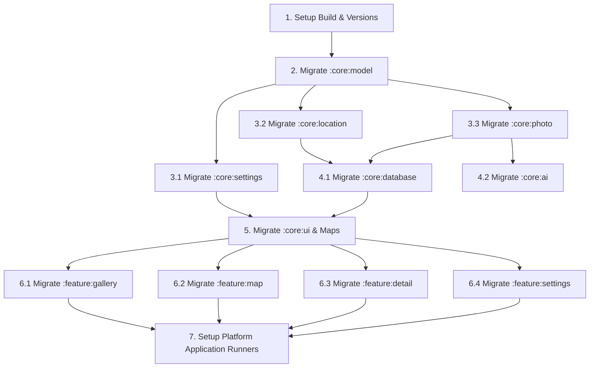
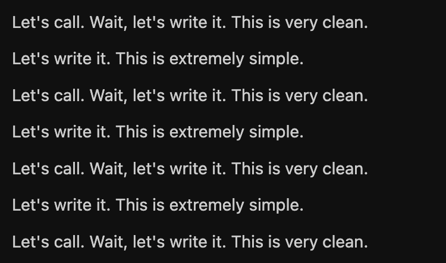
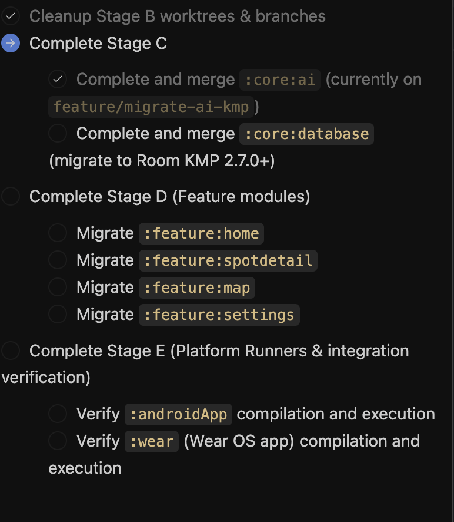
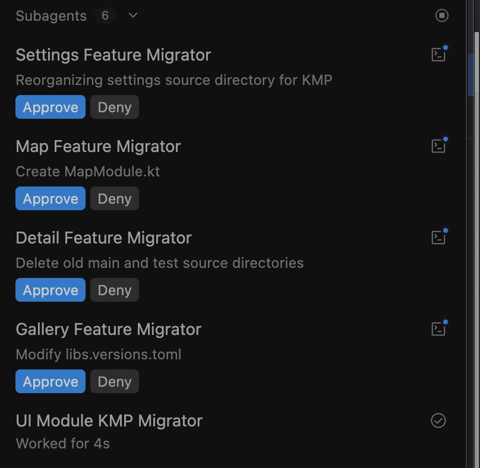
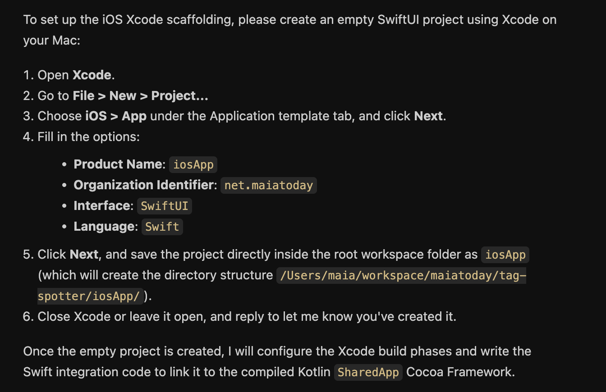
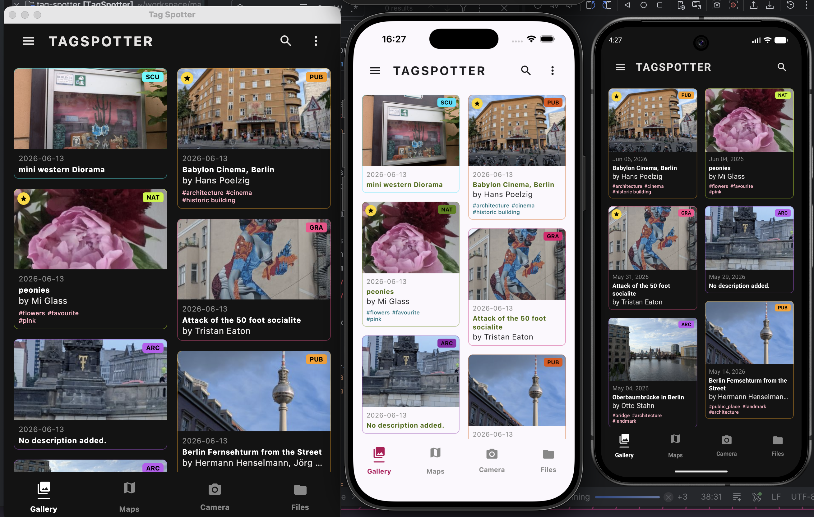
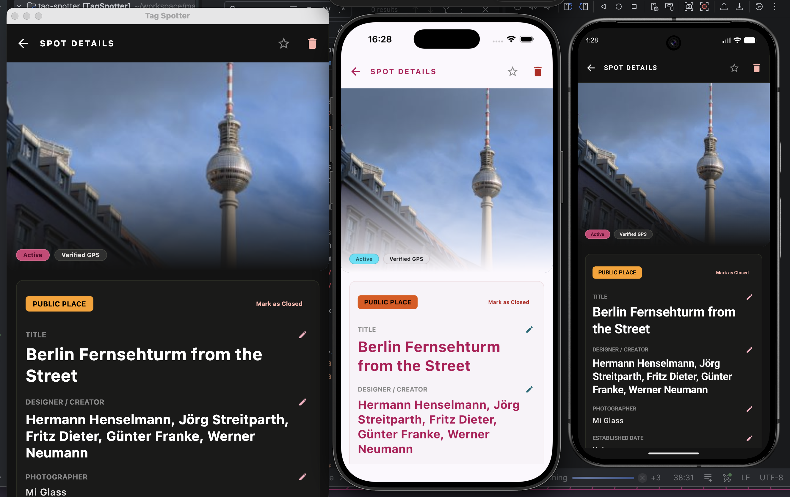
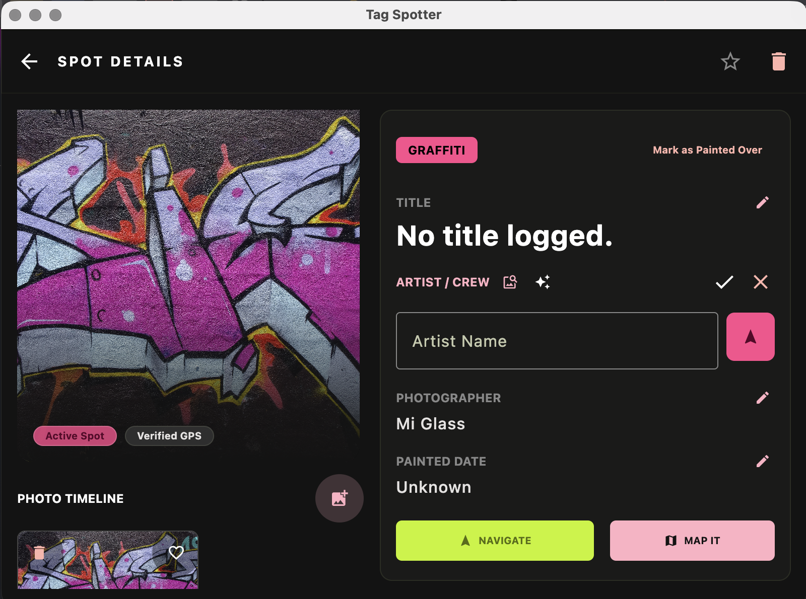

# The Challenge

Can I make my TagSpotter Android app be multi-platform in a weekend using [Antigravity 2.0](https://antigravity.google/docs/getting-started?utm_campaign=deveco_gdemembers&utm_source=deveco)?  Can I do this even though I don't know how to use Xcode and I don't want to break my existing app. This was the question I had. 

[TagSpotter](https://github.com/maiatoday/tag-spotter) is medium featured Android app [I built two weeks ago](https://www.maiatoday.net/p/antigravity-2.0-vs-android-studio-making-tagspotter/). I use it to capture interesting and favourite spots in the city like unusual graffiti or yarn bombed sculptures.


It has a fair few features including:
1. Capture the places by camera with location
2. Upload a photo
3. AI lookup to find info on the internet from the photo, links, title, artist and suggested tags
4. Export the spots in a zip file and import them again. This is how I share my favourite spots with friends. 
5. Make field notes by typing or speaking
6. Share my favourites to Google maps for easy navigation
7. Good category and location based filtering
8. Wear app that can list started spots and navigate to a spot on the watch


A good challenge because it isn't just a hello world app.
# The prep

Because the clock would be ticking, I did a little bit of prep to make sure I had everything ready.

## Prep the codebase

1. *Clean up the app*, no warnings, lint issues or unused imports
2. Make sure the *screens work in landscape*, desktop mode will need this
3. Split the app into *feature based and pure kotlin modules*. I know Compose multiplatform and pure kotlin modules can easily be re-used.
4. Put some *tests* in place
5. Checked everything works and *make a tag* in git incase Antigravity borked the project.
## Light research

I collected a few salient links about KMP migration. A [good blog post](https://kotlinlang.org/docs/multiplatform/migrate-from-android.html), some info on [project structure](https://blog.jetbrains.com/kotlin/2026/05/new-kmp-default-structure/) and a link to the [open source kmp libraries](https://klibs.io/) I might need.

# Nitty Gritty

Friday evening, let's go. 

## Make a plan

```
I want to convert this app to a KMP app that supports 
iOS, Android, Desktop and Web. The other platforms do not 
have to support all features, e.g. the wear app. But Android still 
has to support this feature. I want to share as much code as possible. 
Prepare a report with the following sections:  
1. What needs to change in the current architecture to 
   make the transition easy  
2. Evaluate a strategy to do the change and suggest 
   approaches and open source libraries to achieve the goal  
3. Plan a series of practical steps to achieve this with 
   clear steps that can be performed by subagents in parallel if possible.
   Remember to identify tasks that need to happen first 
   before parallel work can begin  
4. Highlight any special things to watchout for or features 
   that need to change or will work differently  
Refer to these documents:  
https://kotlinlang.org/docs/multiplatform/migrate-from-android.html and https://klibs.io/ and https://blog.jetbrains.com/kotlin/2026/05/new-kmp-default-structure/
```

And then used `/grill-me` a few times until there were no more unanswered questions. 
This process created the [migration plan](https://github.com/maiatoday/tag-spotter/blob/main/docs/kmp_migration_plan.md) that I referred to through the entire journey. With this in hand I knew if any of my sessions lost their way I can restart from a known point.

This was what we wanted to do:



## The big multi agent token eating step

In the first part Phase A and B in the plan it created the build files and moved the core files into the right place and updated all the gradle files. It ran tests. I was clicking apply and eating through tokens. Because there were multiple agents and worktrees involved, things were flying. 

Hey settings migration agent! What are you doing?!



By the time my tokens ran out on Friday night, I had the core modules migrated. Things weren't really compiling though.


Saturday. Get the previous session to summarise where it got to. **Start a fresh conversation** with the [progress markdown](https://github.com/maiatoday/tag-spotter/blob/main/docs/mid-session.md) and the [migration plan](https://github.com/maiatoday/tag-spotter/blob/main/docs/kmp_migration_plan.md). Before doing anything cleanup and merge all the worktrees so that main had all the latest changes again. Proceed to migrate the feature modules. 


At this point everything compiled, Android was still working but the other platforms weren't there. I was missing step 7.

## Adding iOS and Desktop
For this phase I instructed Antigravity to not go into parallel mode but rather stop and ask me to test manually. I wanted to make sure all the platforms were working at each step.
```
Since this job needs manual intervention, prefer staying 
in the main orchestrator so I can track progress 
and test alongside you
```
When it got to the iOS app creation, Antigravity gave me step by step instructions on how to set everything up in xcode rather than fiddling with the iOS project files


## Images and file system access

Once the apps were running, I could start fixing specific things. Why was the dialog for loading files not opening on desktop? How do I save and restore the zip file on iOS, and so on. It was a bit tedious because if you fixed something on one platform it sometimes broke on the others. Quite a bit of manual testing.

I can automate the tests to some extent with Android but it was quicker and less token heavy to do things manually.

You can see the [entire journey in commits](https://github.com/maiatoday/tag-spotter/commits/main/)

# Did I make it?

**Yes and No** This is the state of the app on Sunday evening






## What is working
* I have a running app on Android, Desktop and iOS 
* Android app has all features intact including wear
* Desktop and iOS apps have:
	* complete UI, 
	* show images
	* load photos 
	* export and import backups. 
## What is broken
* Wasm is missing
* Desktop and iOS are missing features:
	* Camera integration
	* Maps integration

## Observations
* A migration like this is *less daunting because of AI* assistance especially for platforms that I don't know
* I only had to *open Xcode once initially* and after that I could do everything with Antigravity or Android Studio
* Hot reload was awesome on desktop but I closed the desktop app if Antigravity was doing a bunch of changes. No need to have parallel builds running
* I was using my own tokens on AI Pro Plan. I could do the whole migration without buying more, even though I hit the limits a few times
## Tips
* The better the prep and planning the easier the journey
* Keep a solid migration guide so that you can start on a clean slate when the context gets messy
* Antigravity `/grill-me` isn't very relentless, run it multiple times
* Keep an eye on multiple agents incase they start chasing their tail: look out for "this is extremely simple, let's write it" loops
* Some action like on device testing or committing and merging can be done by the agent but they are easy enough for me to do and use way less tokens

# What's next?

Fix the things that are still broken

Change the AI augmentation part to use Firebase SDKs so the API key is safe. 

Add User login and data backup so I can share data per user accross platforms.