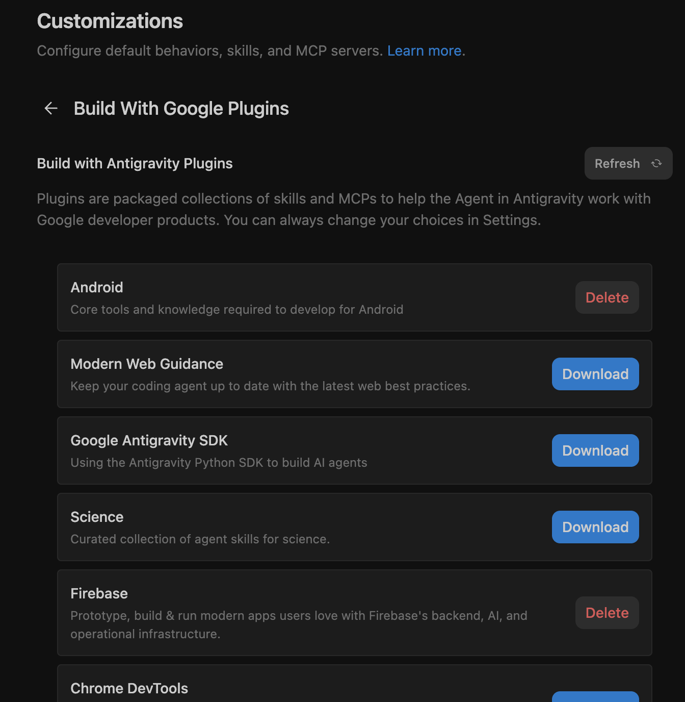
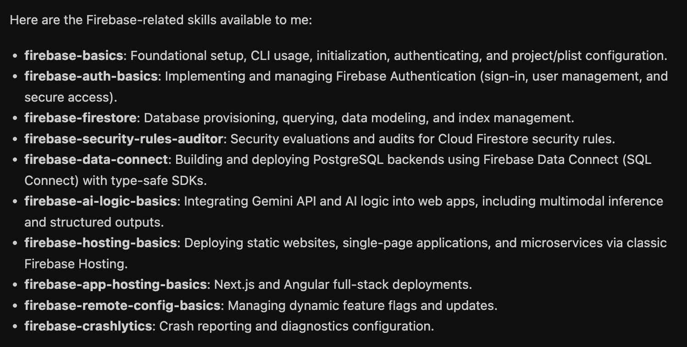
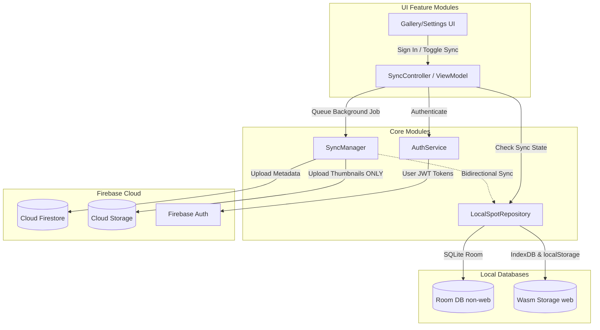
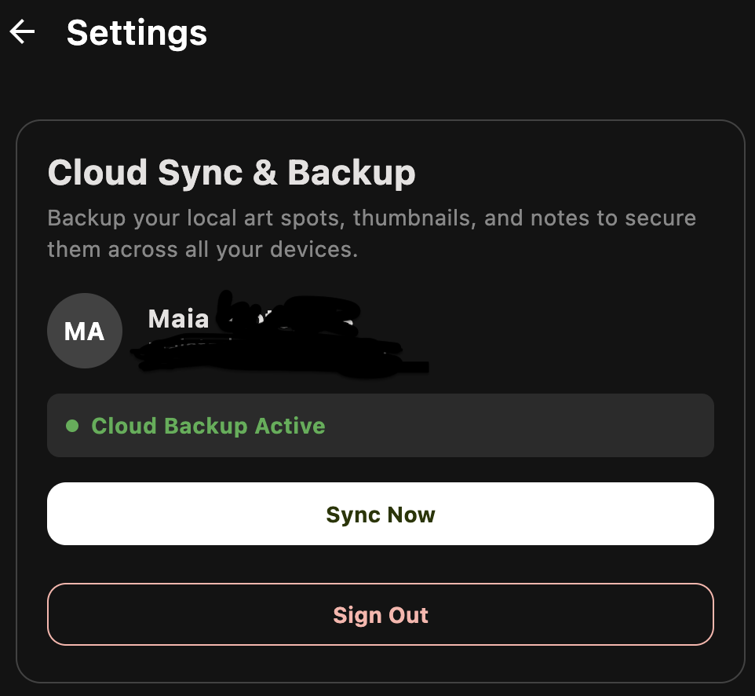
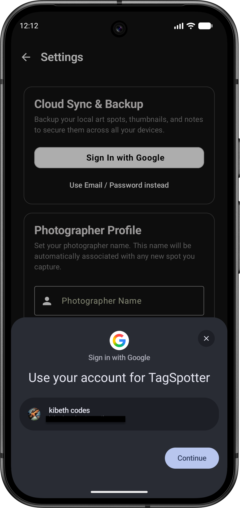
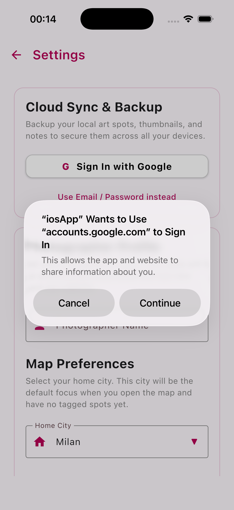
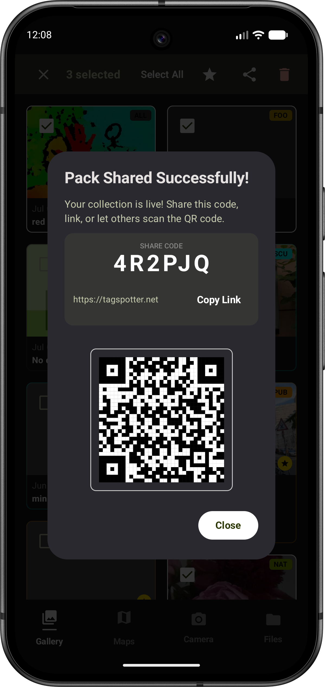

# The challenge - Firebase with Google Plugins

Now that I can [see my graffiti spots on multiple platforms](https://www.maiatoday.net/p/antigravity-tagspotter-kotlinmultiplatform-evolve/) the obvious next step is I want to keep the data in the cloud so that I can capture spots when I'm out and about and then look at them and edit them on the laptop later. For this I need some kind of auth and data storage - like Firebase. Like before, can I do the implementation on a weekend.

Easy enough? Well [Antigravity 2.0](https://antigravity.google/docs/getting-started?utm_campaign=deveco_gdemembers&utm_source=deveco) has firebase super powers in the form of Google shipped plugins but figuring out what I really want and what the edge cases are was not trivial.



# The prep grill-me grill-me grill-me

For this exercise I was pretty confident antigravity could code up my solution. Just look at all these built in firebase skills.


What I wasn't sure of was what I actually wanted. Let's get some ideas. I wanted users that didn't want to log in, not to be forced to do this. So there was the idea of an offline mode. Then when I do log in and I happen to change something on my phone and then on the desktop it should take the latest edit. I wanted it to update in the background but realistically only when I finish editing a spot.

* What happens when I delete a spot?
* How will it work when I import a pack?
* What happens when the photographer name is the same but the email differs?
* Can I have a way to save a pack of spots and just share a code to see it?
* What then, will I be able to change them?
* How does the db schema change?
* What migrations are needed?
* Will the old share packs work?
* How do I even set things up properly on firebase?
* What about desktop, there isn't an SDK for desktop?

 And so on and so on. I was clearly better at asking questions than building especially since I didn't know how to integrate the SDK on iOS. 

I spent about two evenings planning and changing my mind to come up with [this plan](https://github.com/maiatoday/tag-spotter/blob/main/docs/firebase-optional-backup-plan.md) It required multiple rounds of `/grill-me` and also asking antigravity for some suggestions on how things could work and picking the options I liked best. 

The plan had important sections.

1. UX
2. Syncing strategy
3. Architecture
4. Everything broken into implementation phases
5. Aligned Design decisions

The architecture looked like this:


# Let the implementation begin

## Friday

If you look at the [commits](https://github.com/maiatoday/tag-spotter/commits/main/) starting on July 3,  you can see how I implemented the phases. I knew since this was a big implementation the context could get messy. I wanted to use a clean context for each phase. Antigravity stores details of what it does in the artifacts folder. Thats what you see in the right hand panel in overview and what you can look at with the `/artifact` command with the CLI so each phase I started in a new conversation and prompted it something like this. 
```
Please resume our Optional Firebase Login & Cloud Sync implementation at Phase 3: Firebase Platform Configs & SDK Dependency Setup.

Review the completed work in task.md and walkthrough.md in the artifacts folder, and the architectural design in docs/firebase-optional-backup-plan.md for reference.

For Phase 3, please implement:
1. Adding the required versions and library entries for the GitLive Firebase Kotlin SDK in gradle/libs.versions.toml.
2. Initializing and configuring the common :core:sync multiplatform library module gradle builds.
3. Injecting the Google Play Services gradle plugin and config setups on Android.
4. Setting up Apple CocoaPods or Swift Package dependencies in the Xcode project for iOS.
5. Setting up JS/Wasm script links and Firebase initialization inside the webApp's index.html.

Guidelines for this phase:
- Show me your proposed changes for Phase 3 before executing them.
- Once Phase 3 is completed, please STOP and do not proceed to Phase 4.
- Provide a concise summary of the changes made.
- Tell me exactly what I can do to manually verify that the Firebase platform links are correctly configured and compiling on each target.
- Finally, provide me with a pre-configured copy-paste prompt to start Phase 4 in a subsequent clean context.
```

How did I get this prompt? At the end of Phase 2 I asked it 

```
to help me run the next steps, what would the prompt be to continue in a 
clean context. Add to the prompt that I want it to stop at the end of 
the next phase, give me a summary and tell me how to test manually 
and provide a prompt for the next step in a clean context
```

## Saturday

By Saturday morning the 5 implementation steps were done. I got antigravity to either use its tools or by giving me clear instructions on how to set things up on Firebase console. Firebase setup was smooth if manual in places.

However in the process I discovered  there were too many unaddressed edge cases. On desktop antigravity had simply dropped in a bunch of mock implementation. To cover the gaps I had another round of planning resulting in an [additional implementation plan](https://github.com/maiatoday/tag-spotter/blob/main/docs/follow-up-firebase-optional-backup-plan.md) This time I included asking for the prompts in the planning phase. 

## Sunday

Implementation round 2, another 5 phases. done

## A neat trick to handle secrets

In the past I would have a template file that people can copy and then add the real file that contain api keys in the .gitignore with instructions on how to copy the template file in the README.md. I learnt from the antigravity session to do this:

1. Create the file that should contain the secrets e.g. `google-services.json` with fake api keys.
2. Check in the this version and push to git. Safe because there aren't api keys in the file
3. Tell git not to track future changes to this file e.g. `git update-index --assume-unchanged androidApp/google-services.json`
4. Download the real file with the api keys. Since git will assume the file is unchanged it won't suggest that you commit it.

I like this for open source projects because people don't need to fiddle with copying template files just to compile the project.

# Did I make it?

Somewhat, the basics were there but there were still many small niggly things to test and fix. It is going to take me a few more days to polish and get everything smooth.




| Android                                        | iOS                                         |
| ---------------------------------------------- | ------------------------------------------- |
|  |  |



# Learnings

* Thinking what I wanted and **thinking about my intention wasn't trivial**. It took longer than the implementation. But Antigravity is useful for this too
* I had to work sequentially and could not automate the tests because I was still uncovering edge cases
* Large complex implementations benefit from good **phased implementation and clean context** at each phase
* **Good skills make all the difference**. At one point I tried one of the phases in another harness tool using the same model and it could not complete the work 

## How much did it cost? 

Google graciously gave credits for this project. I only used the credits to do the [kmp migration](https://www.maiatoday.net/p/antigravity-tagspotter-kotlinmultiplatform-evolve/) and the firebase integration. I used 109 USD of the credits to complete this work. I'd say two weekends part time and 109 USD isn't bad to get a mid sized app on iOS, Android, desktop and Wasm with login and a full backend support on Firebase. I used a mix of models, choosing the newest models only for complex planning and debugging. 

# What's next

1. I asked the `use /firebase-security-rules-auditor and check my firebase rules` and there are a bunch of things I need to fix.
2. As I test I am logging issues on github.  I'll use `gh` command line tool to fix all of the issues eventually.