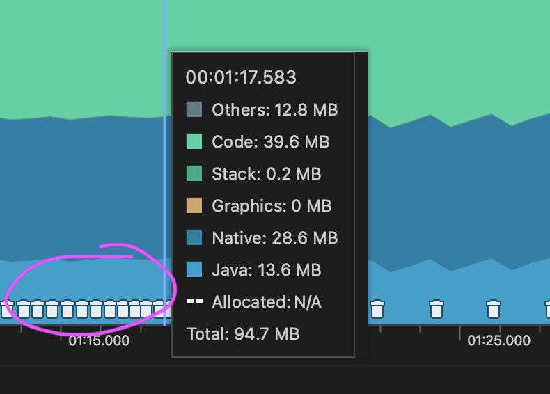
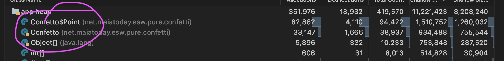
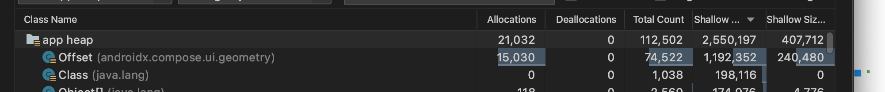
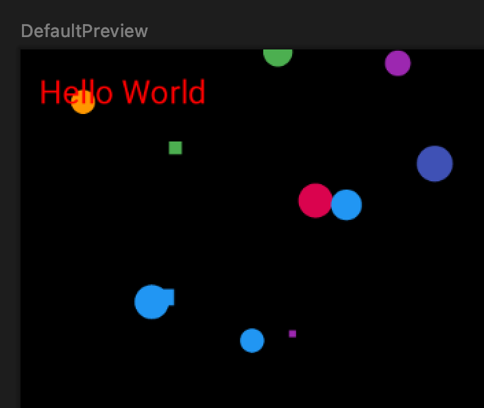

In my exploration of animation in Jetpack Compose I built a Confetti modifier that could be applied to any composable. I first showed the modifier in my [presentation for Chicago Roboto](https://vimeo.com/627636211?embedded=true&source=video_title&owner=18175981) but since I made it something was bothering me. The way that I can get the state in Compose to register change is by making copies of objects or making new objects. For a modifier that uses particles this can be many objects. 

I profiled my original modifier and sure enough I see the object allocation and also the garbage collectore cleaning up when the confetti modifier is visible.





Fast forward to Dec 2021 and my friends over at Code with Italians built a similar [snow modifier](https://www.youtube.com/watch?v=FgZvs1BsAxE&t=1776s). Revisiting my modifier, I cleaned it up. I managed to get rid of some of the object allocation. However since it is a particle system and each of the particles change position, it needs some form of state that changes as the position of the particles change. I used the [Offset class](https://developer.android.com/reference/kotlin/androidx/compose/ui/geometry/Offset) as this is the object that a Circle needs to draw and the object has been optimised to pack the x and y floats. It also has some other useful functions and operators. Offset is immutable so if the particle changes position a new object is made. It is smaller than my original implementation. It isn't really fair to compare the screenshot below with the one above as the time over which the heap capture ran is is not the same. The shallow size of Offset is 16 and the shallow size of the original Confetto objects is 24 and the point inside the Confetto object also has a shallow size of 16. The improvements eliminated the allocation of the extra Confetto object.



My intuition says it is preferable to sprinkle the memory with fewer smaller pieces of confetti rather than many larger ones. Still there isn't really a way around it since Offset is immutable and Compose is built around tracking unidirectional state flow. Mutable State holder classes won't register a change if the object that holds the state doesn't change. This means if I keep an object that holds the position of the particle and I simply change the x and y values in he mutable state holder will not register a change. [Here](https://dev.to/zachklipp/two-mutables-dont-make-a-right-2kgp) is a detail discussion on mutable state.

### How to build your own drawing modifier

You need a extension function on modifier like so-

```kotlin
fun Modifier.confetti(
    // all your parameters to set up the modifier
) = composed { // the composed function gives you a composition on each composable where this modifier is used
    // remeber any state you need here
    var confettiState by remember {
        mutableStateOf(
            ConfettiState(
                // parameters to setup the state
            )
        )
    }

    LaunchedEffect(isVisible) {
        while (isVisible && isActive) {
            withFrameMillis { newTick ->
                // this side effect will return a tick every frame giving 
                // the elapsed time since the previous frame
                // This would be the place where you move the particles
            }
        }
    }

    onSizeChanged {
        // do what you need to do if the size changes
    }.drawBehind {
        // this is where you can draw behind what ever composable content. 
        // It proveds a drawScope with a canvas which you can use
        // e.g. loop through the particles and draw them
    }
}
```

Then it is as simple as adding the modifier to any composable, e.g. here is a black box with red `Hello World` and confetti behind.

```kotlin
Box(modifier = Modifier
        .background(Color.Black)
        .fillMaxSize()
        .confetti()
    ) {
        Text("Hello World", color = Color.Red)
    }
```



The [code for the cleaned up confetti modifier](https://gitlab.com/maiatoday/esw/-/blob/main/app/src/main/java/net/maiatoday/esw/ui/modifiers/ConfettiModifier.kt)


