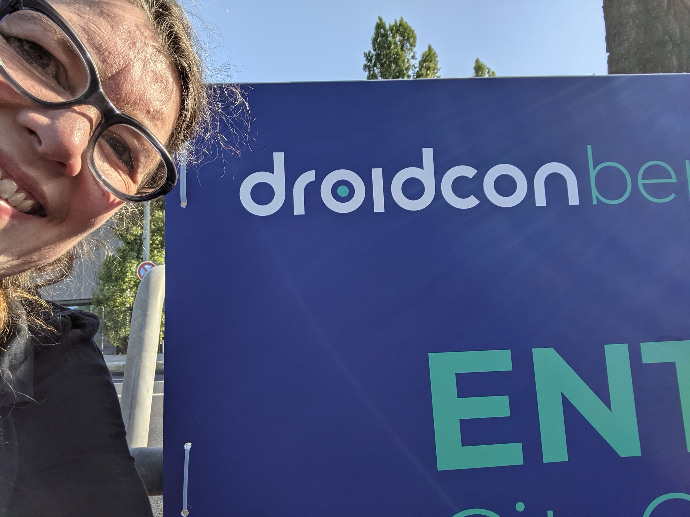
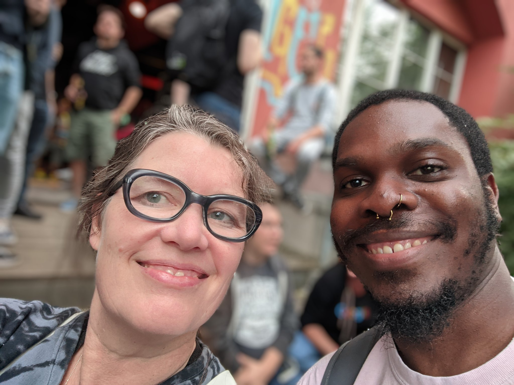
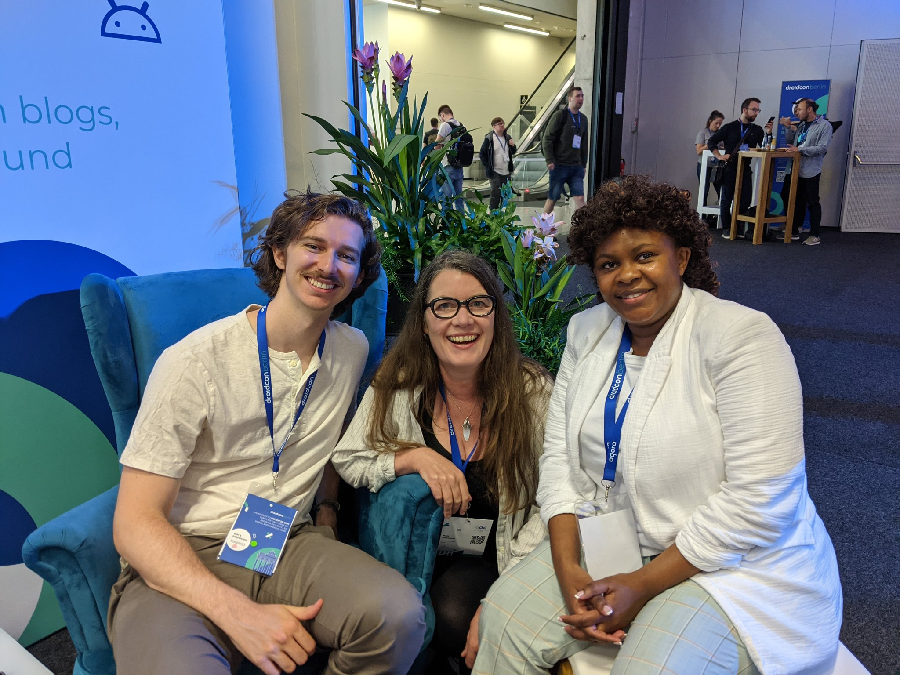
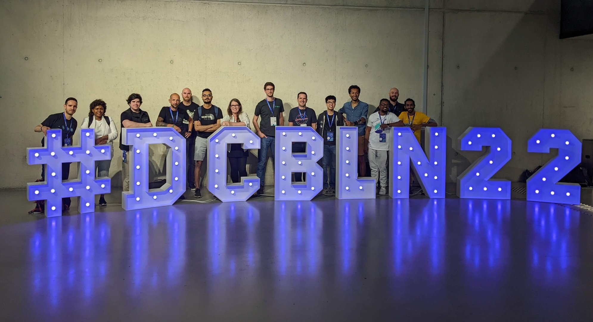
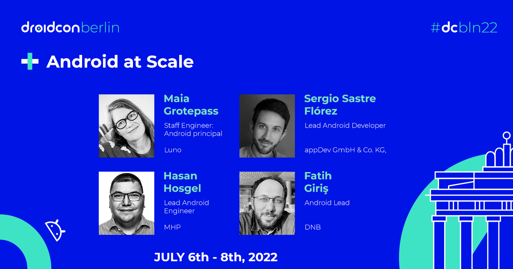
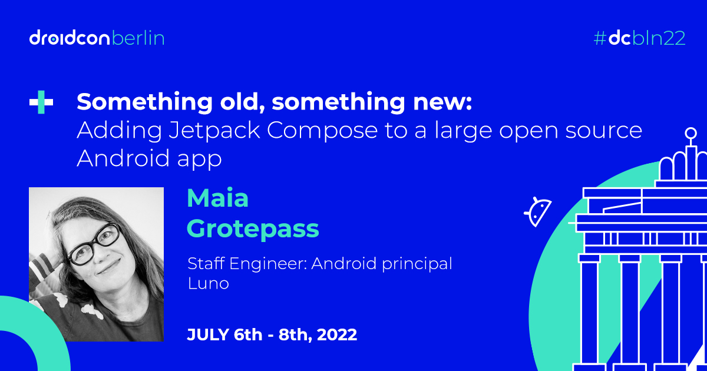

Droidcon Berlin 22 what a blast!

I presented a talk  on Compose. I spoke on a panel and made fantastic new friends and caught up with old/online ones.

The panel discussion was about `Android at Scale`

The talk title was `Something old, something new: adding Jetpack Compose to a large open source app`. 

[Video](https://www.droidcon.com/2022/08/01/something-old-something-new-adding-jetpack-compose-to-a-large-open-source-android-app-2/)

[video](https://www.droidcon.com/2022/08/01/android-at-scale/)
