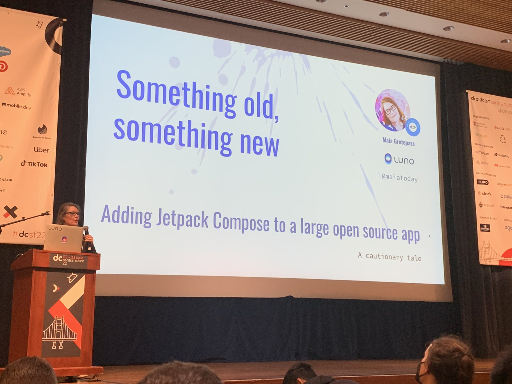
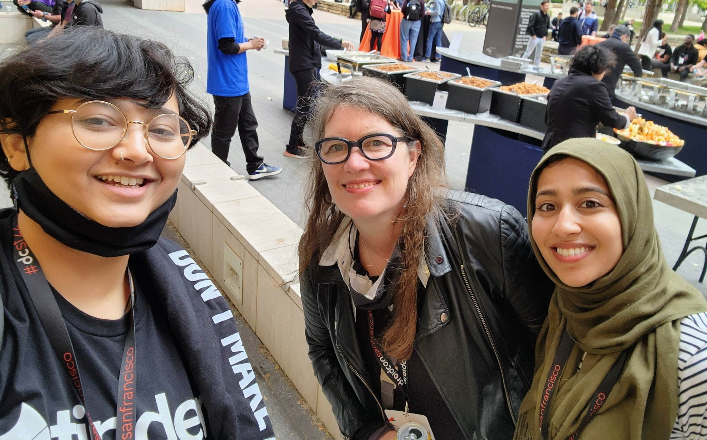

[Droidcon SF 2022](https://www.sf.droidcon.com/), first conference outside of South Africa after the lockdown years. I was so happy to be part of the speakers for my talk titled `Something old, something new - adding Jetpack Compose to a large open source app` 

Here's the abstract:

Jetpack Compose is the new UI framework for Android from Google. Can I take an existing large open source Android app and get the benefit of what compose offers? This talk is a practical report of adding the new UI framework to an existing consumer app. The app I have chosen is Habitica the very popular habit tracking app.

I am presenting this exploration as a travel diary of sorts. It will include:
* Lay of the land: looking at the existing code architecture and assessing where best to add the new framework
* A map and a plan: opinions on architectural choices that make migration easier
* Lists and Columns: a practical demonstration of how to port existing UI
* Here be monsters: recounts of trials and tribulations of working with the existing code and the new framework
* Home again: a demo

I made some lovely new friends, thanks Tasha for the photo.

