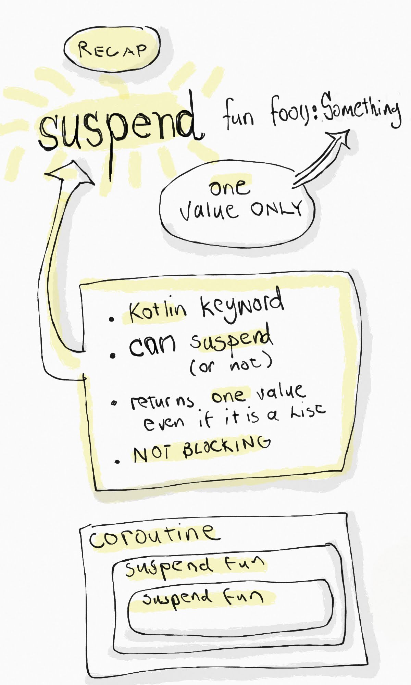
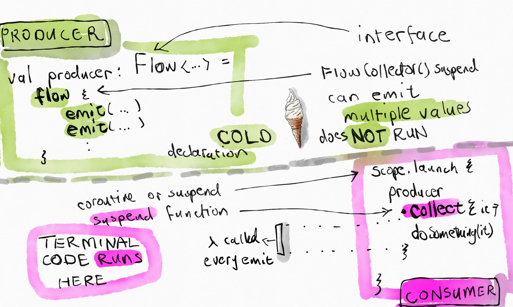
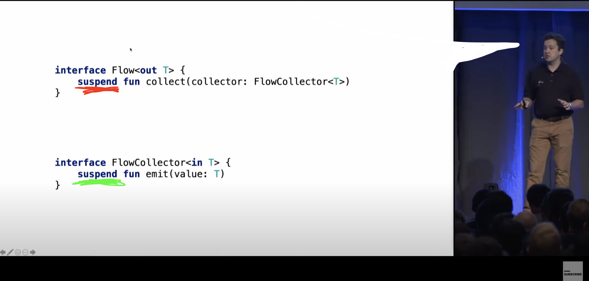
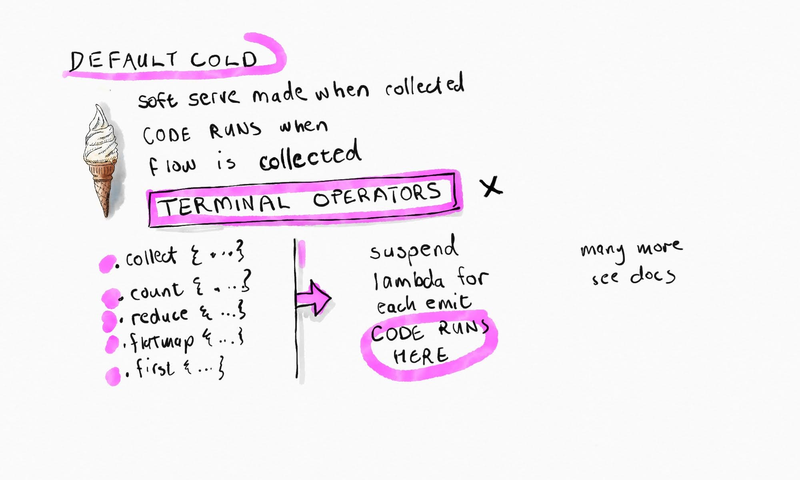
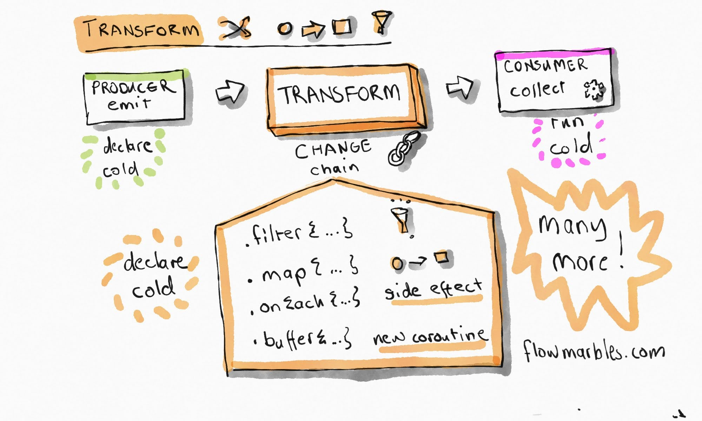
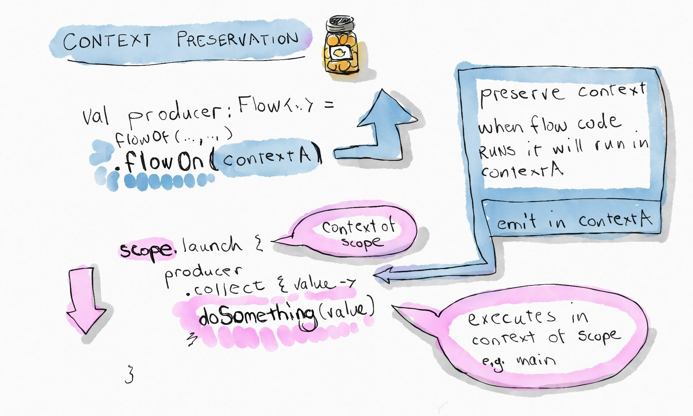
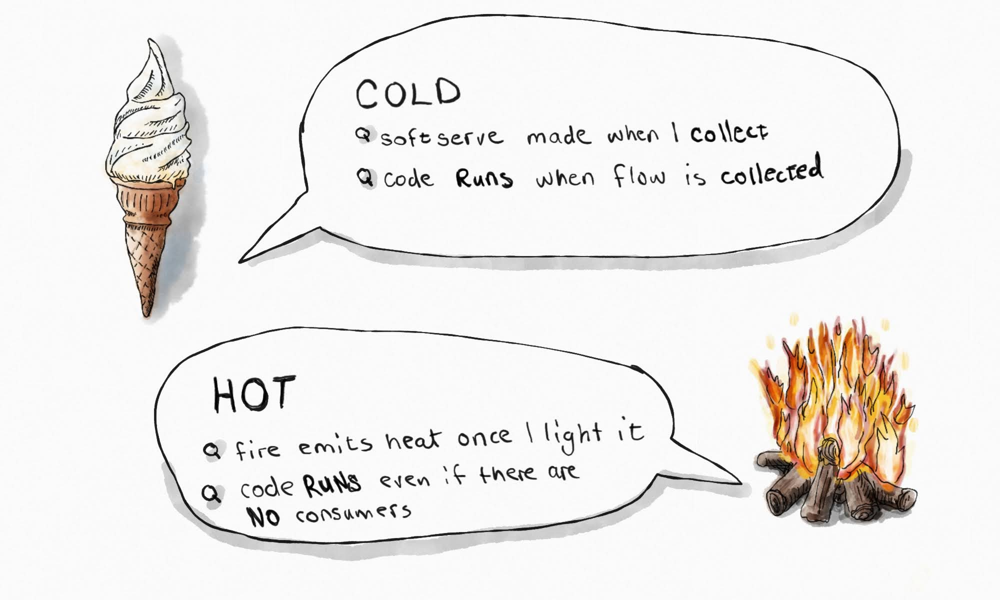
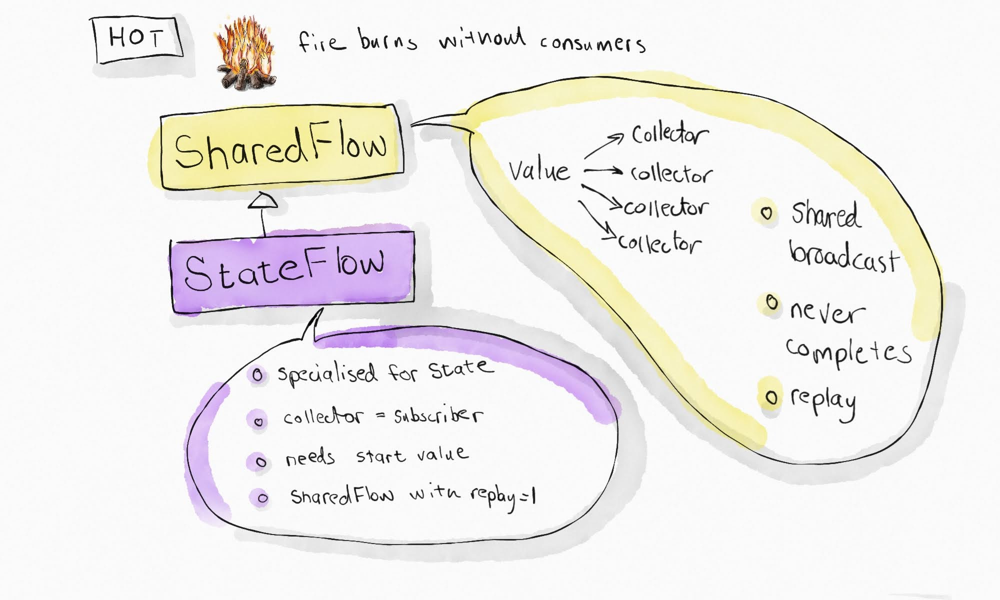
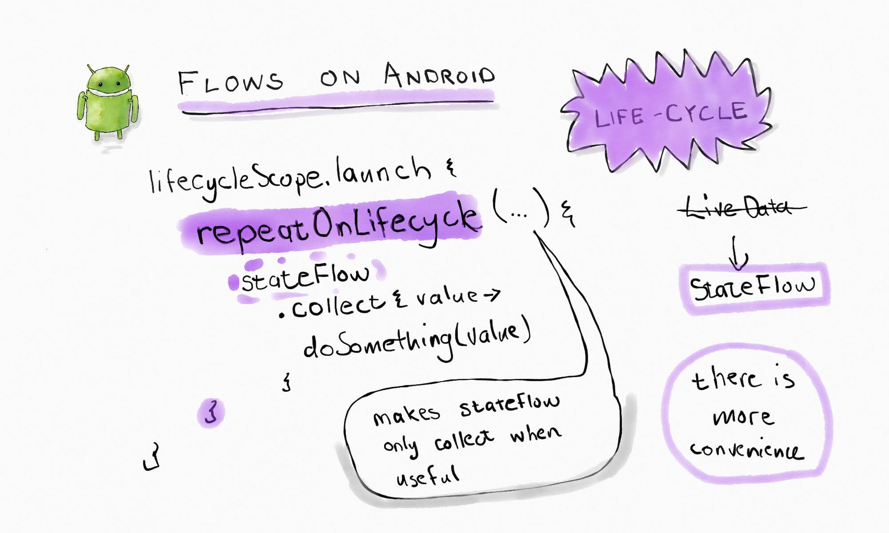

This post is my companion sketch notes for all the resources I consumed on the topic of flows. It is not meant to replace the info that I found on the internet but rather supplement it. Nor is it complete or should it be a standalone guide. In fact you can find an excellent list of my favourite resources at the end of the article. It is a document that helps me make sense of the topic. With that disclaimer out of the way...

 Let's take a step back and look at the suspend function. If your coroutine knowledge is rusty, [freshen](https://kotlinlang.org/docs/coroutines-overview.html) that up [first](https://www.youtube.com/watch?v=_hfBv0a09Jc).

 

What if we want to provide multiple values? A stream of values that can be observed? Enter flows. At their most basic, flows have a **producer** and a **consumer**.

The interface looks like this (spoiler it's just **suspend** functions under the hood)

The consumer gets the **multiple values** by using a **terminal operator**.

If I need to change the produced values along the way before consuming them, there are **transform** operators.

How do I switch from main to io context?

What's with the hot and cold flows? How do I remember which is which?

Some practical hot flows.

Flows on Android 

# References

[Kotlin Coroutines Flow in a nutshell](https://proandroiddev.com/kotlin-coroutines-flow-in-a-nutshell-90399fc9aed7)

[Kotlin Flows ~ an Android cheat sheet](https://rvbsoftdev.medium.com/kotlin-flows-an-android-cheat-sheet-d71ae772030d)

[Kotlin Flows in Android summary](https://proandroiddev.com/kotlin-flows-in-android-summary-8e092040fb3a)

[Android flow](https://developer.android.com/kotlin/flow)

[Asynchronous Flow | Kotlin](https://kotlinlang.org/docs/flow.html#flows)

[Flow under the hood: how does it really work](https://kt.academy/article/how-flow-works)

[KotlinConf 2019: Asynchronous Data Streams with Kotlin Flow by Roman Elizarov](https://www.youtube.com/watch?v=tYcqn48SMT8)

[Kotlin Flows in a Nutshell](https://www.youtube.com/watch?v=B_3iTVJT8Zs)

[FlowMarbles](https://flowmarbles.com/)

[Android StateFlow and SharedFlow](https://developer.android.com/kotlin/flow/stateflow-and-sharedflow)

If you are reading this far I will reward you with an Android portait.

