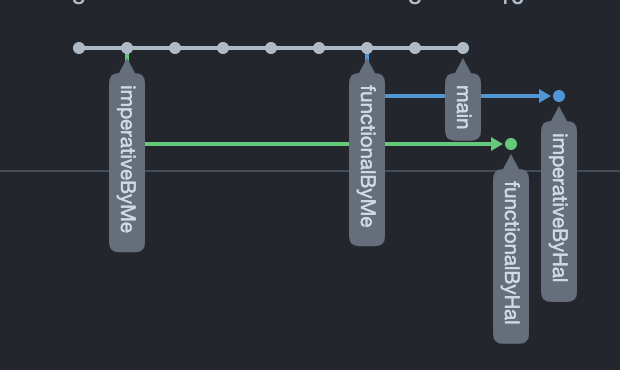
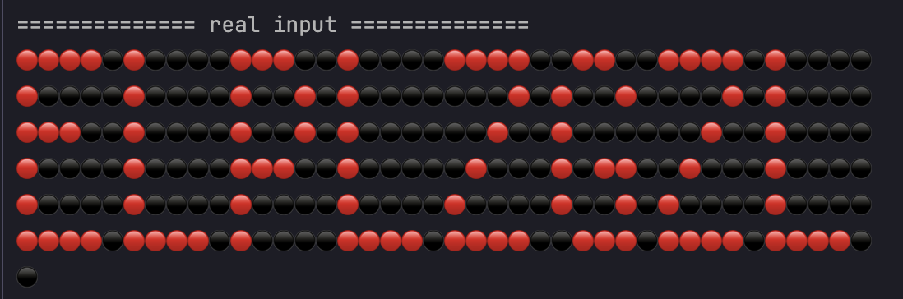
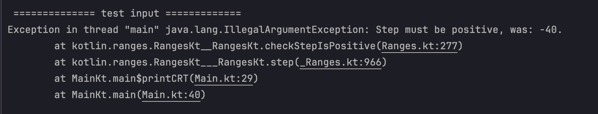

# Once upon a time



I admit. I have a penchant for word games and weird [segues](https://www.merriam-webster.com/dictionary/segue). So I will tell you what this post is about [off the bat](https://dictionary.cambridge.org/dictionary/english/right-off-the-bat). You can [skip to the code](#code-starts-here), I won't be offended. [Fleet 1.19 was released this week](https://blog.jetbrains.com/fleet/2023/06/fleet-1-19-ai-powered-features-and-easier-configuration-for-rust-analyzer-python-interpreters-and-npm/) with an integrated AI assistant. I took it for a spin and used it to convert Kotlin code from imperative style to functional and back again. I used some Kotlin code, which solves the [Advent of Code 2022 Day 10 puzzle](https://adventofcode.com/2022/day/10). I had written the solution in two styles and I had the AI assistant do the same conversion and compared the code. And then I played around and generated some poetry. Follow links at your peril, there are rabbit holes, it might make you [late](https://youtu.be/ZOLpCWlsCjw?t=21) or [change the size](https://www.youtube.com/watch?v=pnJM_jC7j_4) of your free time.

## Segue the first of many

Oh you are still here! You didn't jump to the [__code starts here__](#code-starts-here) section? Why am I doing this? A long time ago, I read a lot of Lewis Caroll, Alice in Wonderland. In one scene Alice talks to the Mock Turtle. He sings a [song about sea creatures dancing](https://en.wikipedia.org/wiki/The_Mock_Turtle%27s_Song). When the first language translators appeared on the scene, [Altavisa babelfish](https://www.babelfish.com) or perhaps it was the [early Google Translate](https://en.wikipedia.org/wiki/Google_Translate), I converted passages from Alice in Wonderland to French and then back again to see what the machines could do. The _Mock Turtle_ was transformed into an _Imitation Tortoise_. In this way the reference to the original [mock turtle soup](https://en.wikipedia.org/wiki/Mock_turtle_soup) was lost in translation. In a roundabout way I was wondering what would be uncovered or lost if I used the AI assistant for some translations in coding style.

## Couplets of doggerel

My trusty and non emotional assistant had no opinion on Lewis Caroll but it made this for me. A definition of **functional programming** style in **rhyming couplets**:

> Functional programming's way,  
> treats functions as the play.  
>
> Immutable states they use,  
> side effects they refuse.  
>
> Declarative code is their choice,  
> with functions, they rejoice.  
> 
> Nested functions map, filter, reduce,  
> a clean, elegant code they produce.  

Compare this with the **imperative** version:

> Imperative code, step by step,  
> commands the flow, with every rep.
>
> Variables mutate, tracking state,  
> loops and branches, integrate.
>
> In sequence order, let it be,  
> line-by-line, instructions see.  
>
> Procedural paths and simple tweaks,  
> It's the classic style, for codes that speak.

[Pshaw!](https://www.etymonline.com/word/pshaw) verbose [doggerel](https://www.merriam-webster.com/dictionary/doggerel) you respond, ok here's ... a [**haiku**](https://www.readpoetry.com/10-vivid-haikus-to-leave-you-breathless/)

## 5-7-5

> **Functional**
>
> Functions pure, combined,  (5)  
> Immutable state and grace, (7)  
> Elegance defined.          (5)  

> **Imperative**
>
> Commands in sequence,         (5)  
> Changing state and execution, (8! or is it 7?)  
> Steps guide its progress.     (5)  

# Code starts here

## Imperative all the way - hand crafted by me

[Here](https://github.com/maiatoday/imp-fun/blob/imperativeByMe/src/main/kotlin/Main.kt) is my initial hand written imperative solution to the AoC 2022 Day 10 CRT problem. There are many [succinct](https://github.com/elizarov/AdventOfCode2022/commit/9353b60158a9690c8517acd40fefe29ccee7f0bd) and [elegant](https://todd.ginsberg.com/post/advent-of-code/2021/day10/) [solutions](https://github.com/topics/aoc-2022-in-kotlin) by other people out there. For this exploration, the changing shape of the code is what interests me. Also to know if the solution is good it needs to have the same output on my input set.


```kotlin
import java.io.File

fun main(args: Array<String>) {

    val crtW = 40
    val crtH = 6

    data class Instruction(val ticks: Int = 1, val inc: Int = 0)

    fun crtDisplay(input: List<String>) {
        val instructions: List<Instruction> = buildList {
            // transform a list of Strings to a list of Instructions
            for (s in input) {
                // transform String to Instruction
                val opcode = s.substringBefore(" ")
                val instruction = when (opcode) {
                    "noop" -> Instruction()
                    "addx" -> Instruction(ticks = 2, inc = s.substringAfter(" ").toInt())
                    else -> error("oops")
                }
                this.add(instruction)
            }
        }
        val xRegisterAtTick: List<Int> = buildList {
            // transform instructions to x register values
            var x = 1 // needs a running x register value
            for (i in instructions) {
                repeat(i.ticks) {
                    this.add(x)
                }
                x += i.inc
            }
            this.add(x)
        }
        for (i in 0 until (crtW * crtH)) {
            // transform xRegister values to pixels(String)
            // chop up in lines
            // side effect: print pixels
            if (i.mod(crtW) == 0) print("\n") //<============  side effect                                                    
            print(if (i.mod(crtW) in xRegisterAtTick[i] - 1..xRegisterAtTick[i] + 1) "🔴" else "⚫️") //<============  side effect
        }
    }

    val testInput = readInput("Day_test")
    println(" ============== test input =============")
    crtDisplay(testInput)
    println("\n\n")
    println("============== real input ==============")
    val input = readInput("Day")
    crtDisplay(input)
    println("\n\n")

}

fun readInput(name: String) = File("src/main/resources/", "$name.txt").readLines()

```
 
## The recipe
You can see my conversion steps in the git repo. The recipe is:  
**Ingredients:**
* 1 problem
* 1 working imperative solution
* tests to taste

**Method:**
1. _Separate_ the variables that **change** from the code that does something.
1. _Separate_ the **side effect** code from the code that does something.
1. _Chop_ the doing code, identified in the previous steps, into bite sized chunks and wrap in small **pure functions**.
1. _Replace loops_ with composed calls such as _map_, _filter_,  _reduce_ calling the pure functions as higher order functions as needed to obtain the same result as the original.

**Build** gently for a few seconds in a preheated **gradle** command, until **BUILD SUCCESSFUL** and serve immediately.

Of course this recipe is an over simplification and build times may vary depending on how big the code is and if you are doing this on a [Rasberry PI model B](https://forums.raspberrypi.com/viewtopic.php?t=183665).

## Here's one I prepared earlier - hand written and functional

```kotlin
import java.io.File

fun main(args: Array<String>) {

    val crtW = 40

    data class Instruction(val ticks: Int = 1, val inc: Int = 0)

    fun String.toInstruction() = when (substringBefore(" ")) {
        "noop" -> Instruction()
        "addx" -> Instruction(ticks = 2, inc = substringAfter(" ").toInt())
        else -> error("oops")
    }

    fun Instruction.expandInstruction(): List<Int> =
        buildList {
            repeat(this@expandInstruction.ticks - 1) { this.add(0) }
            this.add(this@expandInstruction.inc)
        }

    fun Int.toPixel(index: Int, width: Int = crtW): String = if (index % width in this - 1..this + 1) "🔴" else "⚫️"

    fun crtScan(input: List<String>): List<String> =
            input.map { it.toInstruction() }// converts input to instruction
            .flatMap { i -> i.expandInstruction() } // expands multi tick instructions
            .runningFold(1) { x, i -> x + i } // runs through the instructions accumulating x
            .mapIndexed { index, x -> x.toPixel(index) } // converts index and x register to a pixel
            .chunked(40).map { it.joinToString("") } // spilt into lines for the screen

    fun List<String>.display() { // side effect method
        this.forEach {
              println(it)
           }
    }

    val testInput = readInput("Day_test")
    println(" ============== test input =============")
    crtScan(testInput).display()
    println("============== real input ==============")
    val input = readInput("Day")
    crtScan(input).display()
    println("\n\n")
}

 fun readInput(name: String) = File("src/main/resources/", "$name.txt").readLines()

```

## AI converts to functional

Convert my imperative version to functional  
```kotlin
mport java.io.File

fun main(args: Array<String>) {
    val crtW = 40
    val crtH = 6

    data class Instruction(val ticks: Int = 1, val inc: Int = 0)

    fun parseInstruction(s: String): Instruction {
        val opcode = s.substringBefore(" ")
        return when (opcode) {
            "noop" -> Instruction()
            "addx" -> Instruction(ticks = 2, inc = s.substringAfter(" ").toInt())
            else -> error("oops")
        }
    }

    fun buildXRegisterAtTick(instructions: List<Instruction>): List<Int> {
        var x = 1 // needs a running x register value
        return instructions.flatMap { instruction ->
            List(instruction.ticks) { x }.apply { x += instruction.inc }
        } + x
    }

    fun printCRT(input: List<String>) {
        val instructions = input.map(::parseInstruction)
        val xRegisterAtTick = buildXRegisterAtTick(instructions)

        val crtRows = (crtW * crtH until 0 step -crtW).reversed().map { lineStart ->
            (lineStart until lineStart + crtW).joinToString("") { i ->
                if (i % crtW in xRegisterAtTick[i] - 1..xRegisterAtTick[i] + 1) "🔴" else "⚫️"
            }
        }

        println(crtRows.joinToString("\n"))
    }

    val testInput = readInput("Day_test")
    println(" ============== test input =============")
    printCRT(testInput)
    println("\n\n")
    println("============== real input ==============")
    val input = readInput("Day")
    printCRT(input)
    println("\n\n")
}

fun readInput(name: String) = File("src/main/resources/", "$name.txt").readLines()
```
Oh dear, this doesn't work!

Some issue with the loop not using a downTo and getting the ranges wrong. I like the separate functions but it is mixing in some side effects.

## AI converts back to imperative

Convert to imperative from my functional version  

```kotlin
import java.io.File

fun main(args: Array<String>) {
    val crtW = 40
    val crtH = 6

    data class Instruction(val ticks: Int = 1, val inc: Int = 0)

    fun parseInstruction(s: String): Instruction {
        val opcode = s.substringBefore(" ")
        return when (opcode) {
            "noop" -> Instruction()
            "addx" -> Instruction(ticks = 2, inc = s.substringAfter(" ").toInt())
            else -> error("oops")
        }
    }

    fun buildXRegisterAtTick(instructions: List<Instruction>): MutableList<Int> {
        val xRegisterAtTick = mutableListOf<Int>()
        var x = 1 // needs a running x register value
        for (instruction in instructions) {
            for (i in 0 until instruction.ticks) {
                xRegisterAtTick.add(x)
            }
            x += instruction.inc
        }
        xRegisterAtTick.add(x)
        return xRegisterAtTick
     }

    fun printCRT(input: List<String>) {
        val instructions: MutableList<Instruction> = mutableListOf()
        for (s in input) {
            instructions.add(parseInstruction(s))
        }
        val xRegisterAtTick = buildXRegisterAtTick(instructions)

        for (i in 0 until (crtW * crtH)) {
            if (i % crtW == 0) print("\n")
            if (i % crtW in xRegisterAtTick[i] - 1..xRegisterAtTick[i] + 1) {
                print("🔴")
            } else {
                print("⚫️")
            }
        }
    }

     val testInput = readInput("Day_test")
     println(" ============== test input =============")
     printCRT(testInput)
     println("\n\n")
     println("============== real input ==============")
     val input = readInput("Day")
     printCRT(input)
     println("\n\n")
}

fun readInput(name: String) = File("src/main/resources/", "$name.txt").readLines()

```

# The end
To close I leave you with a [git repo](https://github.com/maiatoday/imp-fun/branches) and these lines of sage advice in doggerel format from the AI assistant. What can I say, I am amused!

> Functional's not a cure-all,  
> For some problems, it may stall.  
>
> Yet, grasp its ways, and you'll see,  
> Cleaner code and clarity.  
>
> Incorporate with grace and skill,  
> More maintainable code, you'll build.

And as a bonus here's the prompt that generated this gem.
```
Take the coding advice in quotes and convert it to rhyming couplets
"Keep in mind that functional programming may not always be the best choice
for every problem or coding style, but understanding and
incorporating functional concepts can help create cleaner, more maintainable code."
```