Here's the situation. You find a snippet of Kotlin code somewhere on the Internet or in a book.  You want to try it out. What is the quickest path to messing with the code? Here are some recipes for some options. I sorted them from the quickest no tools and no project all the way through to all the tools and all the projects. I'll  provide info on how to add a library as dependencies if possible in each of the solutions.

All of the options are free except the Intelij Enterprise IDE one.

*Disclaimers:*
1. This is not a complete guide, it is opinionated and it is a snapshot of the current state of the tools. Things always change and your favourite may not be listed.
2. I tested most of these on my Mac so the solutions are Mac-centric. If you want to try them on another OS, you may need to fiddle and research a bit more.
3. I usually code for myself or for mobile so no serverside or web code or docker containers.


# Quicklinks

Here is an overview with links so you can jump directly to what suits your needs

| Tools |  No project | with project|
|-------|-------------|------------|
| Browser|  [Playground](#playground) | [Datalore](#datalore) |
| CLI | [Compile and run](#compile-and-run) [REPL](#repl) | [Amper](#amper) [Gradle](#gradle)|
| Fleet | 👆 See CLI section|  👆 [Amper](#amper) [Gradle](#gradle) |
| Intellij Community/Android Studio | [Scratch file](#scratch-file)| [Wizard](#wizard)|
| IDE Intellij Enterprise (not free) | [Notebook](#intellij-enterprise-and-notebook) | See Intellij Community section |

[Resources](#what-next)

# Browser

This recipe is for when you don't have a computer where you can install things. Maybe you are on a tablet or you are in an internet cafe in an unknown place or borrowing your neighbours laptop. It is good for code snippets that use standard java or kotlin libraries and output text.

## Playground

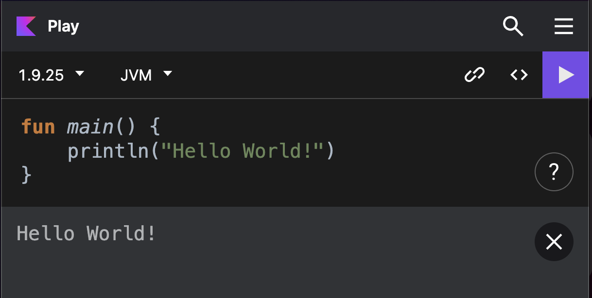

### You need
* A browser
* A website that can run code e.g. [Kotlin playground](https://play.kotlinlang.org)

### Recipe

1. open [this](htps://play.kotlinlang.org) website 
2. paste or type some code 
3. run `Ctrl + R`

### Adding dependencies

A good way to see what you can add is to autocomplete an `import` statement. You have access to kotlin, kotlinx, java and javax. If you want to add other libraries you need to run your own instance of the kotlin playground with the libraries you need or you need to find an instance where this is supported. Not really recommended. I would just use an [Amper](#amper) project if you need dependencies.

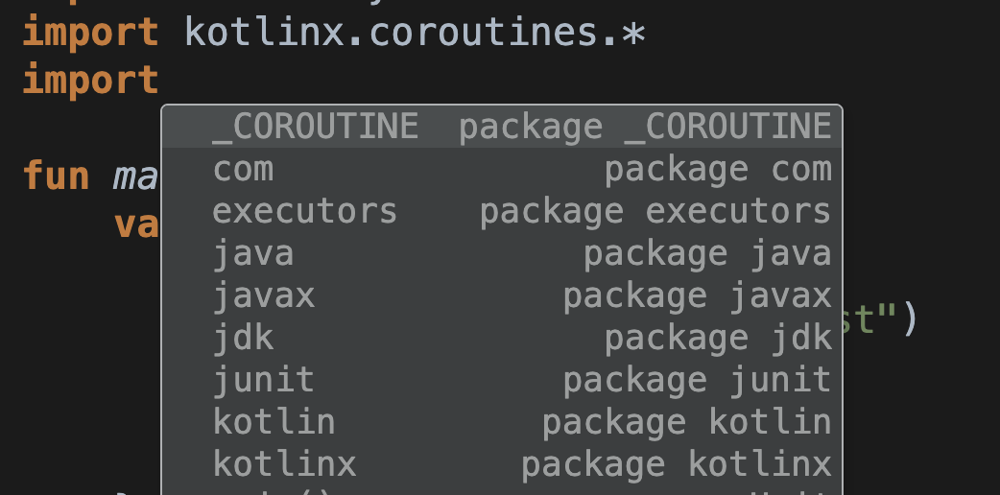


## Datalore

This solution is still Browser based. It is useful if you want to collect a few pieces of Kotlin code and you like a Notebook interface and the supported tools. There is a free tier of Datalore available.

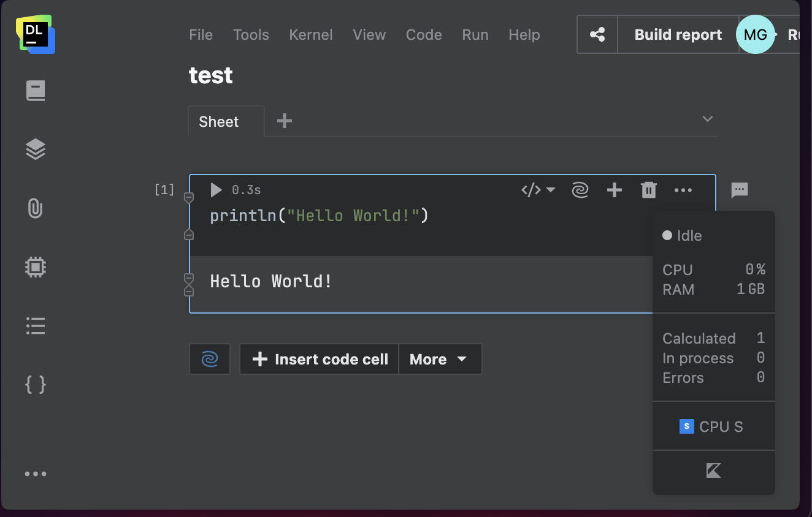

### You need

* A browser
* A Datalore login 

### Recipe

1. open [this](https://datalore.jetbrains.com) website and log in
2. Open a new kotlin notebook and paste or type some code in a code cell
3. click the run button


### Adding dependencies

The trick with the autocomplete on import works here too.  You have access to kotlin, kotlinx, java and javax. You can also add some select libraries like [kandy](https://kotlin.github.io/kandy/welcome.html) with the `%use` magic word.

# CLI

This is for people who are happy to run things on the command line. It doesn't matter where the code is created, it could be vim or an echo command. Read more at the [official kotlin docs](https://kotlinlang.org/docs/command-line.html).

## Compile and run

The bare bones approach but it becomes a pain if you want to use libraries other than the standard ones or you want to split your code in more than one file.

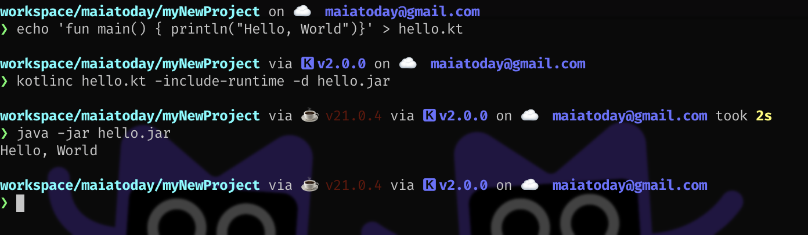

### You need
* A [terminal](https://iterm2.com/)
* A [Java installation](https://formulae.brew.sh/formula/openjdk)
* The [kotlin compiler](https://formulae.brew.sh/formula/kotlin)

### Recipe

1. `echo 'fun main() {   println("Hello, World")}' > hello.kt`
2. `kotlinc hello.kt -include-runtime -d hello.jar` # compile the code and package it in a jar with a runtime
3. `java -jar hello.jar` # run the jar with java

### Adding dependencies

You need to add dependencies on the command line, this may be a pain as you probably need the jars to include them. (not recommended)

## REPL

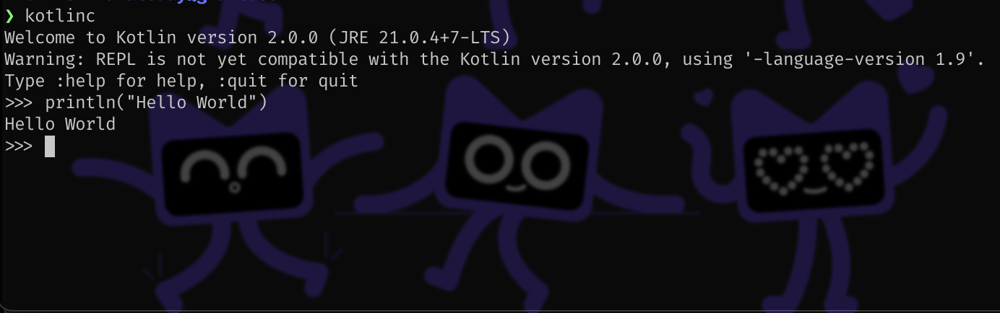

REPL stands for **r**ead-**e**val-**p**rint-**l**oop. It is an interactive environment to run code. If you have the kotlin compiler installed you can simply run `kotlinc` and you will be in the REPL. `^C` to kill it and exit. Use only for very transient experiments.

## Gradle

This recipe uses gradle to generate a template project. You can then add all the files and dependencies to the project.

### You need
* A [terminal](https://iterm2.com/)
* A [Java installation](https://formulae.brew.sh/formula/openjdk)
* A [gradle installation](https://formulae.brew.sh/formula/gradle)

### Recipe

1. `mkdir myNewProject; cd myNewProject`
2. `gradle init` # follow the prompts choosing application and kotlin and mostly defaults. See the screenshot for my choices. Every thing should be setup with the files in the `app/src` folder and `gradlew` script in the root of the project
3. `./gradlew run` # runs the project - on Mac/Linux or `./gradlew test` to run tests

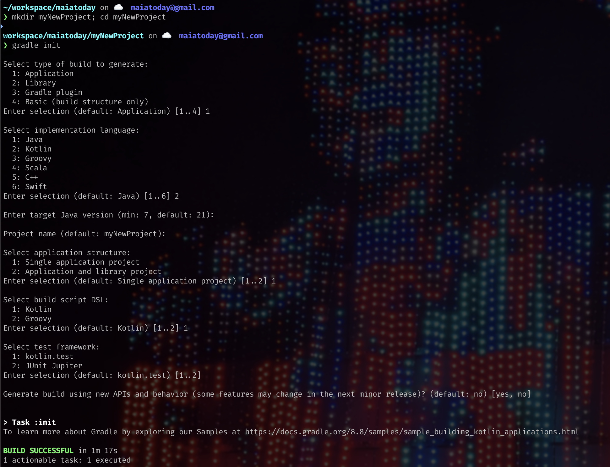

### Adding dependencies

You can add dependencies in the `app/build.gradle.kts` file in the dependencies section. You need to explicitly add a dependency for stdlib and kotlinx libraries

## Amper

Same as the gradle solution but using Amper. It gives a simpler more streamlined project. It can use gradle under the hood.

### You need
* A [terminal](https://iterm2.com/)
* A [Java installation](https://formulae.brew.sh/formula/openjdk)
* A [gradle installation](https://formulae.brew.sh/formula/gradle)

### Recipe

1. `mkdir myNewProject; cd myNewProject`
2. Pull a version of the [amper cli](https://github.com/JetBrains/amper/blob/release/0.4/docs/Usage.md#using-the-standalone-amper-version-from-the-command-line) with this command. Note the version number may change if you read this in the future.
    ```curl -fsSL -o amper "https://packages.jetbrains.team/maven/p/amper/amper/org/jetbrains/amper/cli/0.4.0/cli-0.4.0-wrapper?download=true" && chmod +x amper```
3. `./amper init jvm-cli` # to create a fresh jvm command line project
4. `./amper run` # to run the project

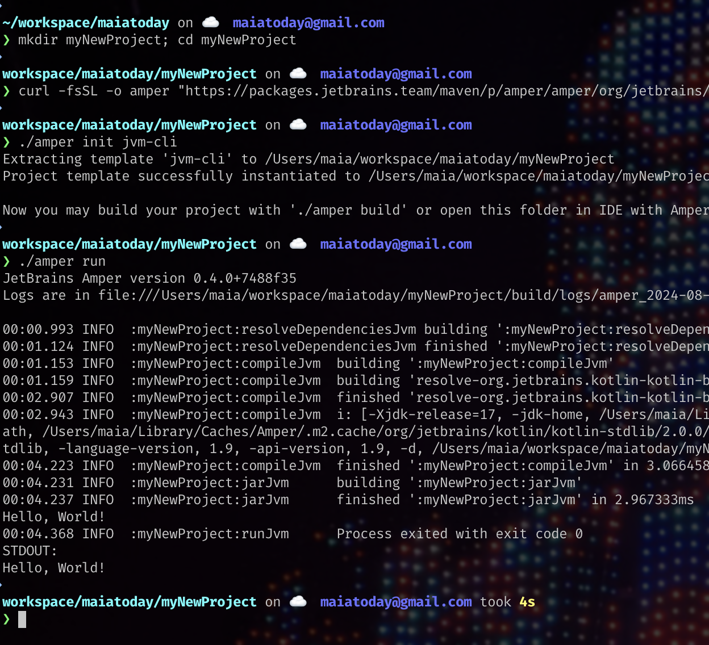

The source is in src directly. It is a much shallower project structure.

### Adding dependencies

You can add dependencies in the `module.yaml` file in the [dependencies](https://github.com/JetBrains/amper/blob/release/0.4/docs/DSLReference.md#dependencies-and-test-dependencies) section. The syntax is like this:
```yaml
dependencies:
    - groupId:artifactId:version
```
You need to explicitly add a dependency but you have access to stdlib and kotlinx libraries.

# IDE with a project or without

This solution is for when you have the luxury of a computer where you can install tools such as Intellij, Fleet or Android Studio. These tools will come with prepackaged JDKs and wizards to get you going. You can of course use these tools with the CLI projects you created. They do offer a way to run code without having a project.

## Fleet

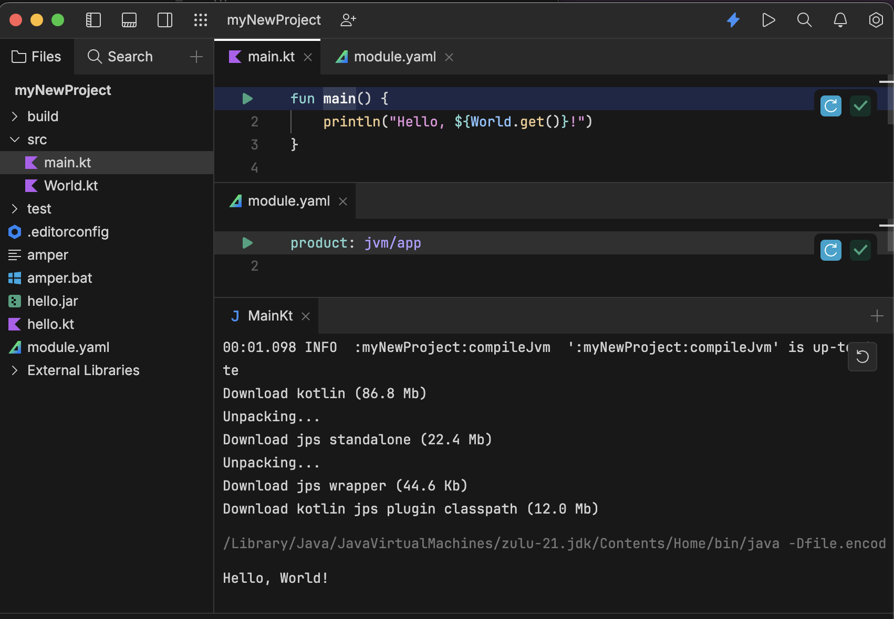

[Fleet supports Amper and Gradle](https://github.com/JetBrains/amper/blob/release/0.4/docs/Usage.md#using-amper-in-fleet). Making new projects are still simplest with the command line instructions above. Then you can open the project in Fleet. The Fleet integration gives convenient run buttons in the gutter so you don't need to any run configuration setup.

### You need
* A project created on the CLI as in the [previous step for Amper](#Amper) or [Gradle](#Gradle)
* A Fleet installation from Jetbrains Toolbox

### Recipe

1. Open the root folder of the project in Fleet
2. Navigate to the `main` method and use the gutter icon to run

### Adding dependencies

Add libraries in the same way as the CLI projects.

## Scratch file

[Scratch files](https://www.jetbrains.com/help/idea/scratches.html) are usefull for transient code. They live in a folder that is independent of the project that you are in and so can be seen from any project you open. They are only supported in Intellij and Android studio.

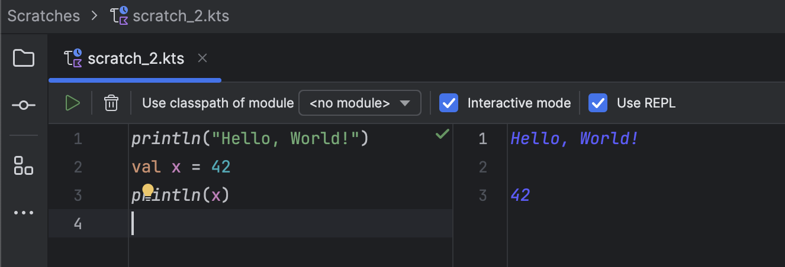

### You need

* Intellij Community/Android Studio, I use the [Jetbrains toolbox app](https://www.jetbrains.com/toolbox-app/)

### Recipe

1. Open the IDE and open any project or create a new kotlin one, this will setup a project but we won't use it.
2. Press `Shift-Cmd-N` to open a new scratch file, choose Kotlin
3. Paste the code press `Ctrl + R` or the run button. See the screenshot.

### Adding dependencies

It is [possible to add dependencies](https://www.jetbrains.com/help/idea/scratches.html#use-dependency-in-scratch-file) but you need to add it to the module in the project and then update the run configuration of the scratch file. This is probably more useful if you have a project setup.

## Intellij Enterprise and Notebook

Intellij Enterprise supports the Kotlin Notebook plugin. It is a similar experience as the [Datalore](#Datalore) experience. The useful thing about a Notebook in Intellij is that you can also access code you may have in the project.

### You need

* Intellij Enterprise, I use the [Jetbrains toolbox app](https://www.jetbrains.com/toolbox-app/)
* The [Kotlin Notebook plugin](https://plugins.jetbrains.com/plugin/16340-kotlin-notebook)

### Recipe

1. Open the IDE and open any project or create a new kotlin one, this will setup a project but we won't use it.
2. Press `Cmd Shift A` and choose `Kotlin Notebook`
3. Paste the code in a new code cell
4. press `Shift +Enter` or the run button. See the screenshot.

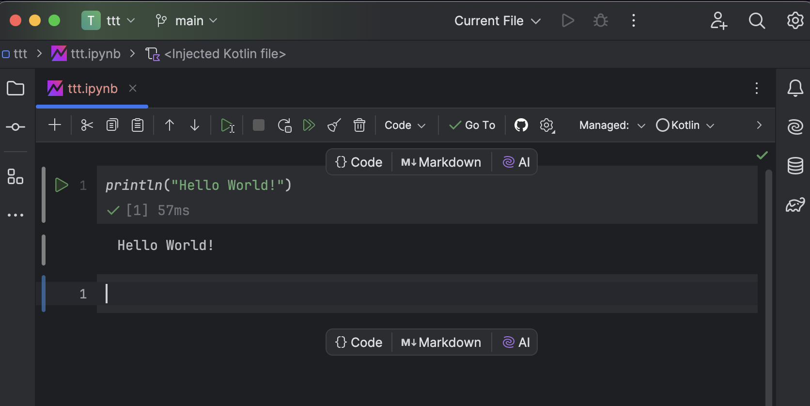

### Adding dependencies

You can add [dependencies](https://github.com/Kotlin/kotlin-jupyter#dependencies-resolving) like this:
`@file:DependsOn("groupId:artifactId:version")`

You can  use your own project files in the Notebook by adding the project files to the notebook.

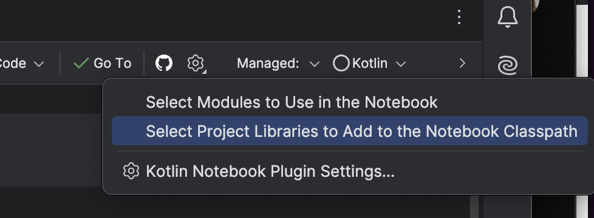

You can include some dependencies like [kandy](https://kotlin.github.io/kandy/welcome.html) by using the `%use` magic keyword.

# IDE all the way

This is the gui-est and most complete solution. Also the solution if you want to build a project that you want to work on. Of course you can use the CLI options but you can let the wizard create a template for you.

## Wizard

The recipe is deceptively simple but I refer to the [official docs for finer details](https://www.jetbrains.com/help/idea/create-your-first-kotlin-app.html#create-project). I suspect no-one reads this far anyway. The wizard makes a gradle project and but if you would like to use Amper you need a plugin.

### You need

* Intellij /Android Studio, I use the [Jetbrains toolbox app](https://www.jetbrains.com/toolbox-app/)

### Recipe

1. Open the IDE and open any project or create a new kotlin one
2. Code and run

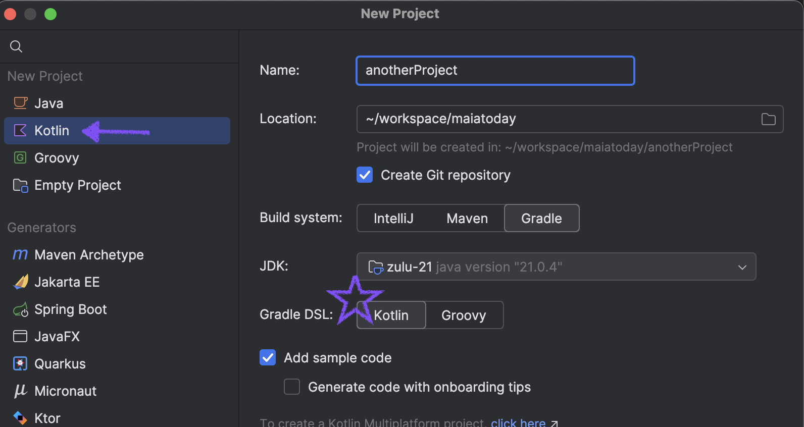

Dependencies work the same way as the CLI projects. There is also a project view to add them

# What next?

Hmm I hear you say "But I want to draw pictures or graphs - no more ascii for me"

You'll have to wait for another blog post for more on that. This one is far too long already.

In the meantime you have all these places to run your code. Now you can can go learn more Kotlin at these resources:

## Official documentation

[kotlinlang.org](https://kotlinlang.org/docs/home.html)

[kotlin youtube](https://www.youtube.com/c/kotlin)

## Books

[Kotlin In Action, second edition](https://www.manning.com/books/kotlin-in-action-second-edition)

[Atomic Kotlin](https://www.atomickotlin.com/atomickotlin/) with matching [training in the IDE](https://plugins.jetbrains.com/plugin/17654-atomickotlin?_gl=1*kliojt*_gcl_au*MTc2MDkwMjU0MC4xNzE5NjcwMzI3*_ga*MTk0MzI1MDcwOS4xNjk0OTgzMDA4*_ga_9J976DJZ68*MTcyMzM4Mzc3Ni45Mi4xLjE3MjMzODU0NzIuNTguMC4w)

## Free courses

[Kotlin Bootcamp](https://developer.android.com/codelabs/kotlin-bootcamp-welcome#0)

## Practise: Puzzles, Koans and Katas

[Exercism Kotlin track](https://exercism.org/tracks/kotlin)

[Advent of code](https://adventofcode.com/)

[Kotlin Koans](https://kotlinlang.org/docs/koans.html)

[Gilded Rose in Kotlin](https://github.com/emilybache/GildedRose-Refactoring-Kata/tree/main/Kotlin)

## Newsletters

[Kotlin Weekly](https://kotlinweekly.net/#latest)

## More on Notebooks

[Notebook Demo](https://www.youtube.com/watch?v=WdeCsUzv0c8&t=1026s)


