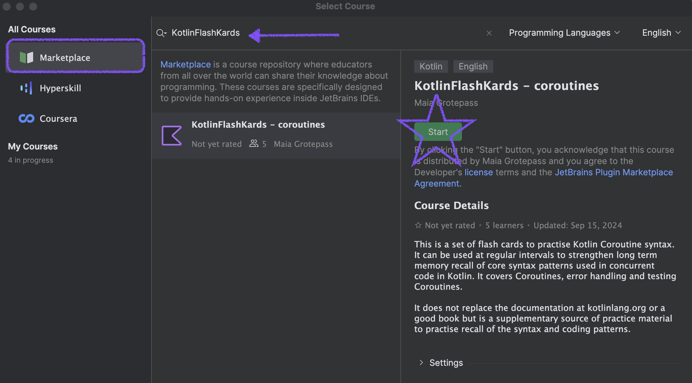
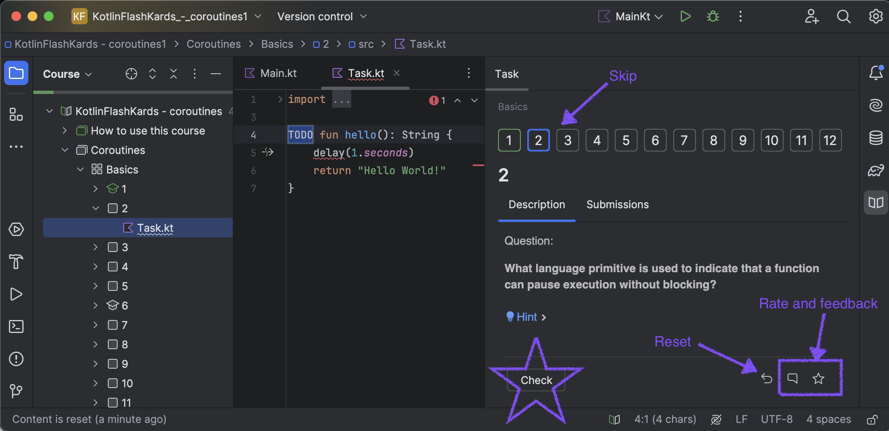

I made something. I made [a set of flash cards to practise and learn Kotlin coroutines](https://plugins.jetbrains.com/plugin/25329-kotlinflashkards--coroutines?noRedirect=true). I call them KotlinFlashKards (with a K of course). Here is my first set. It helps to learn coroutines

## Why create flash cards?

Does this happen to you? You are writing some code, you know something is possible but you can't remember exactly how to do it. By the time you have asked an AI or researched you have forgotten what it was you wanted to do in the first place.

There is a way to fix this. Learn and remember the key concepts you use often. One way to do this is to use flash cards. I learnt this from the book [The Programmers Brain by Felienne Hermans](https://www.manning.com/books/the-programmers-brain)

## How does it work?

The deck doesn't replace the [docs](kotlinlang.org) or a [good book](https://www.manning.com/books/kotlin-in-action-second-edition).It is an in IDE course in the form of a question, a hint that hides the answer and a code snippet with a test to explain the concept. It has four sections
* Basics - 18 cards
* Structured Concurrency - 12 cards
* Error handling - 7 cards
* Testing - 6 cards

You can explore the sections in order or dip in and try tasks at random.

## Strategies to get the best out of the course?

1. **Repeat at regular intervals** -  Memories are built up if you **repeat** the flash cards at **regular intervals**. It is better to a few lessons more often than to do many lessons in one sitting. You can do the course many times or choose which areas to practise.

2. **Recall the answer before peeking** -  It is important to try to recall the syntax first before looking at the hints or letting the IDE help you. This means you practise your **recall** of the memory.

3. **Think about the solution** -  For each question and answer you will remember it better too if you think of a practical place where you could use similar code.

## How do I get it?

You need:
* a JetBrains IDE like Android Studio or Intellij Community edition
* the [JetBrains Acadamy plugin](https://plugins.jetbrains.com/plugin/10081-jetbrains-academy) installed

Then do the following:
1. Before opening a project click on the Learn menu
2. Click on New course
3. In the `Marketplace` search for `KotlinFlashKards` and start the course. This will make a local instance of the course
4. Have fun and explore, try figuring out the answers to the questions and don't peek before you have thought a bit.
5. If you mess up the code reset it with this button.
6. If you want to skip ahead use the arrow or the numbers.

## What else can I do?

* Rate the course
* Give feedback
* Tell me if there are other topics you want flash cards on, I have a flows one coming out soon

