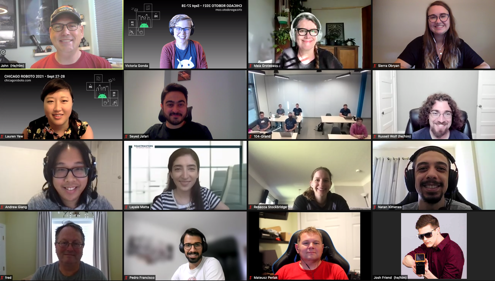

I presented a talk for Chicago Roboto 2021 and for GDG Cape Town titled Magic Sprinkles: Adding animations to and existing app. Below are the videos of both talks and the slides

[Slides](https://docs.google.com/presentation/d/1wEeHTF5JRftnaMAf4_xARfA5zIKCn5Vfy9W4JVtfggY/edit#slide=id.p)

[Chicago Robot video](https://chicagoroboto.com/session-videos/?vimeography_gallery=5&vimeography_video=627636211)

GDG Cape Town video


