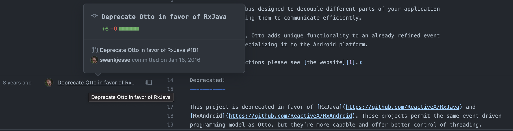
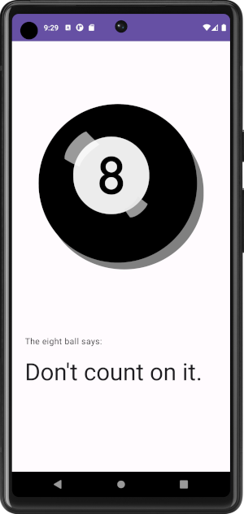

## The story starts

I was wandering around my day job's code base and I happened on a time capsule - a pristine Java Activity studded with semi-colons, a snapshot of how we built things in 2014. All the member variables started with `m` and there was plenty of logic to update the screen and dictate actions. Despite being old, it's still used every day by users. Why would I change it?

## The Bus disappears

Well, it got its data from a subscription to the Otto Bus. Otto Bus was deprecated in 2016.

A blog post suggested migrating to RxJava, but since our code base standard now involves coroutines, Flows, and in some cases, LiveData, I decided to remove deprecated libraries and complete the partial migrations we started some time ago. 

This blog post summarizes how to migrate from Otto Bus to Flow.

I've also created a [Git repo](https://github.com/maiatoday/Pocket8Ball) with a simplified example that uses Otto Bus, with a conversion to Flow in the commit history. Check out the `otto-bus` tag for the working Otto Bus version and the `flow` tag for the converted Flow version. I am sparing you the Java to Kotlin conversions. This toy app lets you tap on the 8 ball for a message. It uses Otto Bus to notify the 8 Ball that a new message is needed as well as when a new message is available.



## How to tackle the migration - step by step

Here are the basic steps for this kind of migration:
1. Pick one **event**
1. Find All the **producers** of this event (hopefully, there is only one but don't count on it)
1. Replace with compatible **functionality**. We'll look at how to choose compatible functionality in the next section. Things will be broken.
1. Find all **subscribers** of this event by looking for `@Subscribe` annotations. Replace with a matching access mechanism. Things should work at this point.
1. **Test** that everything that used this one event still works
1. **Repeat** with the next event until there are no events left to migrate
1. **Remove** the Otto bus and it's dependencies
1. **Celebrate!**

Of course this looks deceptively simple. As simple as it is to add otto bus to a code base. It may require some architectural refactors and modifications of how the dependency injection works in your app. Also if you were using otto bus to drive navigation, a Flow is not the right solution. I suspect the swamp you find yourself in is larger, deaper and much much more tangled. To this I would say, I hold you in my thoughts and I hope you have tests.

## Why is the bus in the app

I do have some advice on choosing an alternative implementation. It depends on why the otto bus was introduced in the app in the first place. The thing to understand is that the event bus pattern allows multiple producers to drop events into the bus from all over the app. On the other side of the bus any number of subscribers can wait for a particular event without knowing the origin of the event. This _extreme loose coupling_ is handy however it means
* nothing is stopping you from coding up something unmaintainable
* in large projects it is difficult to follow the logic
* it is difficult to write tests

For each of the events in your case ask yourself these questions.

### Async observable state

Was the bus used to observe a state in an asynchronous way? If this is the case, you can replace the bus with an observer pattern using a StateFlow. The producer and subscriber will be more tightly coupled but you will get cognitive support from clearer architecture. You will also get some IDE support and autocomplete to help you. You will need to look at the architecture or the dependency injection to make sure the subscriber has access to the producer so it can collect the StateFlow.

### Synchronous notification

Was the bus to notify one area in the code that something happened elsewhere? If this is synchronous then a simple method call may suffice. Again you will need to look at the architecture or the dependency injection to make sure the class notifying has access to the class that provides the method. Wrapping class that receives the notifigation in an interfaces will make testing this code easier.

### I really really really need a bus

If the bus was legitimately used because you have many places in the app that need to respond to an event, you can recreate the bus functionality with a singleton and a SharedFlow. Inject the Bus into all the classes that need it and provide the SharedFlow from the injected class. Then subscribers can `collectLatest` on the `SharedFlow` and filter for the events they are interested in. Provide a method to emit something on the bus. There is a [branch in the sample repo](https://github.com/maiatoday/Pocket8Ball/blob/flow-bus/app/src/main/java/net/maiatoday/pocket8ball/di/BusModule.kt) with a simple implementation of this.

```kotlin
interface FlowBus {
val bus: SharedFlow<BusEvent>
    suspend fun post(event: BusEvent)
}

object BusModule: FlowBus {
    private val _bus = MutableSharedFlow<BusEvent>(replay = 0)
        override val bus: SharedFlow<BusEvent>
            get() = _bus

    override suspend fun post(event: BusEvent) {
        _bus.emit(event)
    }
}
```

The BusEvent is a sealed class.

```kotlin
sealed class BusEvent

data class MessageFromTheAether(val answer: String) : BusEvent()

object ShakeItUp : BusEvent()
```

### None of this will work for me

You can always resort to using a [Broadcast receiver](https://developer.android.com/guide/components/broadcasts) to send a message from one part of your app to another. One thing to note if you go this route is that you will only be able to use this solution in the Android app and not in shared Kotlin only modules. 
        
## Example in the repo - Easy swap to StateFlow

For my toy example the producer that emits data is the Magic8Ball. Instead of posting an event on the bus, make the data available in a StateFlow.

```kotlin
BusModule.bus.post(MessageFromeTheAether(latestMessage))
```

is replaced with

```kotlin
private val _answer = MutableStateFlow("")
val answer: StateFlow<String>
    get() = _answer.asStateFlow()
    
 // and then later when a new message is needed
_answer.value = latestMessage
```

In my example the subscriber of the data is the ViewModel.

```kotlin
@Subscribe
fun revealAnswer(message: MessageFromeTheAether) {
    _uiState.value = Reveal(message.answer)
}
```

is replaced with this snippet in typically the init block of the view model

```kotlin
viewModelScope.launch {
    eightBall.answer.collect { answer ->
        _uiState.value = Reveal(answer)
    }
}
```

Here is the  matching video showing all the code changes.


