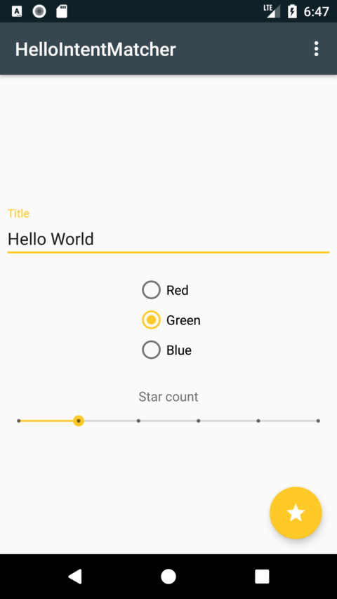

I want to make my little experiments public and save them as a reminder for future me. So here is yet another post on Matchers and Espresso testing.

I want to test this:

1. First activity starts another activity at a button click.

2. First activity passes a parcelable object to the second activity.

3. Test that the intent that starts the second activity contains the object with the correct properties.

I built a contrived example, MainActivity collects some info and passes this to StarActivity in a parcelable called ContrivedParams. See the sample code [on GitHub](https://github.com/maiatoday/HelloIntentMatcher).




To write the tests I brushed up on [Hamcrest](https://en.wikipedia.org/wiki/Hamcrest)[\[1\]](http://hamcrest.org/JavaHamcrest/javadoc/1.3/overview-summary.html)[\[2\]](https://www.planetgeek.ch/2012/03/07/create-your-own-matcher/)[\[3\]](http://www.vogella.com/tutorials/Hamcrest/article.html): a library that makes it easier to write readable tests. Instead of

```kotlin
assert(expected==actual)
```

you can write almost-english

```kotlin
assertThat(actual, is(expected))
```

which is a sugar coated version of

```kotlin
assertThat(actual is(equalto(expected)))
```

Sadly though _is_ is a [hard keyword in Kotlin](https://kotlinlang.org/docs/reference/keyword-reference.html) so I ended up using the _isA()_ and _equalTo()_ varieties of calls rather than escaping _is_ with backticks.

Another reason to use Hamcrest — better error messages. Compare these two messages.

```kotlin
java.lang.AssertionError  
 at net.maiatoday.hellointentmatcher.ContrivedParamsTest.showErroMessagesTest(ContrivedParamsTest.kt:37)
```

with the message given by a custom matcher

```kotlin
java.lang.AssertionError:   
Expected: title should return “Hello World”  
 but: was “Hello World!”  
 at net.maiatoday.hellointentmatcher.ContrivedParamsTest.showErroMessagesTest(ContrivedParamsTest.kt:42)
```

or the error message given by an object matcher

```kotlin
java.lang.AssertionError:   
Expected: <ContrivedParams(title=Hello World, starCount=3, colour=#00b0ff)>  
 but: was <ContrivedParams(title=Hello World!, starCount=4, colour=#00b0fff)> at net.maiatoday.hellointentmatcher.ContrivedParamsTest.showErroMessagesTest(ContrivedParamsTest.kt:47)
```

The parameters for the second activity is passed in a parcelable data class.

I used the [Espresso-intents library](https://developer.android.com/training/testing/espresso/intents.html) . Start the activity with an `IntentsTestRule`. The IntentsTestRule initialises the Espresso intents before each test and releases them again after the test completes. I used the `intended` method to test the intent and the `hasEntry` method to check for the extra. I compared the extra with an expected object. As a bonus I wrote a custom matcher to check the properties of the object that was in the intent. Custom matchers are useful if you do not need to check all of the properties in the data object.

The intent test:

One of the custom matchers:


All green
