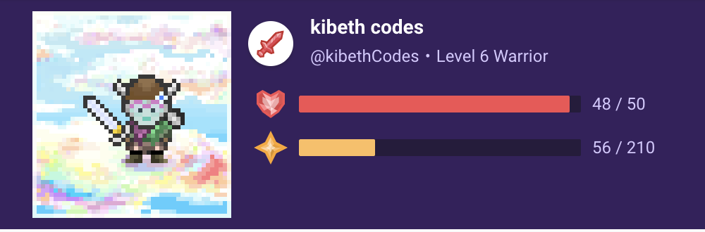

To practise for live speaking and to explore how to add Jetpack Compose to an existing open source app, I start a twitch stream as [kibethcodes](https://twitch.com/kibethcodes). The app I chose to work on is [Habitica](https://github.com/HabitRPG/habitica), a habit tracking/ToDo app that saw it's first commit in 2015.  

Streaming Tuesdays at 19:00 UTC+2

Here are a selection of highlights of the twitch stream.






