## Why
I want to play with the recently released [Compose Hot reload feature](https://www.jetbrains.com/help/kotlin-multiplatform-dev/compose-hot-reload.html) by JetBrains. To do this I setup a Desktop compose project and picked a topic to draw and explore: [Vaporwave](https://en.wikipedia.org/wiki/Vaporwave) Why? because Vaporwave is a curious Internet thing that has a strong visual aesthetic that I wanted to recreate. It is intriguing. It is seems to be a fleeting transient phenomena: it is in the name *vapor* and *wave* and yet... and yet we see it [pop](https://www.aesdes.org/2025/01/23/vaporwave/) [up](https://www.creativeboom.com/insight/why-vaporwave-is-set-to-be-a-huge-design-trend-in-2023/) in unexpected [places](https://rausgegangen.de/en/events/vaporwave-paradise-vaporwave-fest-cologne-0/). It is a form of [hauntology](https://en.wikipedia.org/wiki/Hauntology#:~:text=Hauntology%20(a%20portmanteau%20of%20haunting,if%20to%20haunt%20the%20present. ): a cultural idea that returns from the past to haunt the present.

There will be ramblings interspersed and remixed with code, I will put the code at the beginning of the sections, so that you can easily skim if remix-rambling is not your thing. Yes, there is a [matching repo](https://github.com/maiatoday/vapor).  Yes, it is a mix of organic hand coding and AI enhancements. I will [explain my process](#enter-the-ais).

But first
## Setting up Hot Reload

You need:
1. A project that has a Compose desktop part. It can be stand alone or part of a multiplatform project
2. Use a Kotlin version 2.1.20 or later
3. Get the [plugin and the latest version information](https://github.com/JetBrains/compose-hot-reload) and add it the place you keep your versions, like a toml file
4. Setup the plugin in your build.gradle.kts
5. Setup the foojay resolver
6. Run the main application from the gutter icon or command line. something like `./gradlew runHot --mainClass MainKt --auto`
7. Optional extra make a run target for your particular main application if you have more than one
See and [example](https://github.com/maiatoday/vapor/blob/main/howToAddHotReload.md) of each line in the sample repo

*Wow these instructions are vague!* indeed things change quickly. Please follow the original repo. This post will date.

## Origins and Sound track
Vaporwave appeared as a music genre with a strong aesthetic, some say in 2010. The iconic album [Floral Shoppe by Macintosh Plus](https://vektroid.bandcamp.com/album/floral-shoppe) is still available an makes a perfect sound track for inspecting the code or reading this article.

*Go ahead click the [link](https://vektroid.bandcamp.com/album/floral-shoppe) and start the music. I'll wait.*

 As we are on the cusp widespread changes in how we interact with technology, will we have nostalgia for the way we did thing in the "olden days"? Will we even remember how it really was?

## A-E-S-T-H-E-T-I-C

Vaporwave is known for a strong aesthetic. Here is a jumpstart table with the technique and a note. **Click on the image to see the code**. or scroll for more detail

| Image                                                                                                                                                                                                                                                                                                                                         | Techniques                                                                                                                                                                                                                         | Notes                                                                                                                                                                                                                                                                                                                           |
|-----------------------------------------------------------------------------------------------------------------------------------------------------------------------------------------------------------------------------------------------------------------------------------------------------------------------------------------------|------------------------------------------------------------------------------------------------------------------------------------------------------------------------------------------------------------------------------------|---------------------------------------------------------------------------------------------------------------------------------------------------------------------------------------------------------------------------------------------------------------------------------------------------------------------------------|
| <a href="https://github.com/maiatoday/vapor/blob/62643066a19564a06507ef86a399aead1527994e/src/main/kotlin/aesthetic/Triangle.kt#L26">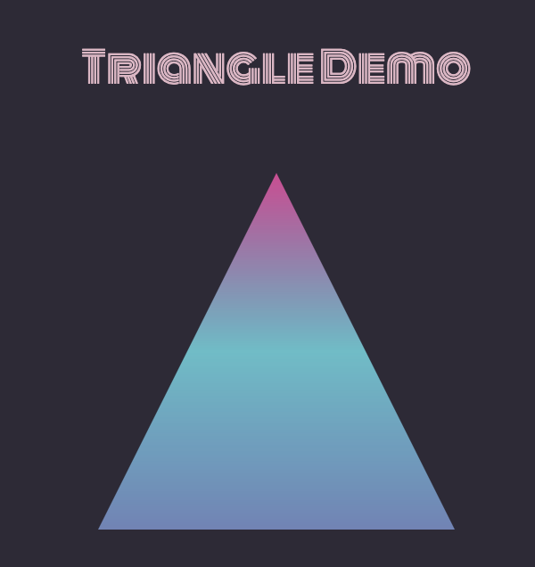</a> [code](https://github.com/maiatoday/vapor/blob/62643066a19564a06507ef86a399aead1527994e/src/main/kotlin/aesthetic/Triangle.kt#L26)               | Path on Canvas, Linear gradient brush                                                                                                                                                                                              | Triangles are geometric shapes reminiscent of corporate logos of the eighties. An abstract shape that becomes a place holder for ambiguous concepts                                                                                                                                                                             |
| <a href="https://github.com/maiatoday/vapor/blob/62643066a19564a06507ef86a399aead1527994e/src/main/kotlin/aesthetic/VanishingFloor.kt#L37">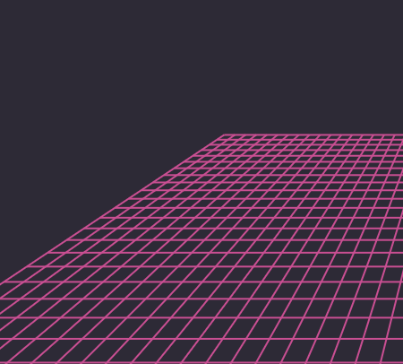</a> [code](https://github.com/maiatoday/vapor/blob/62643066a19564a06507ef86a399aead1527994e/src/main/kotlin/aesthetic/VanishingFloor.kt#L37) | Canvas, Offset and Path, conversion of Offset to create perspective                                                                                                                                                                | a magenta grid looks like something from a pixelated game: A technology that we recognise and  remember imperfectly with nostalgia. It also has a black and white tiled version.                                                                                                                                                |
| <a href="https://github.com/maiatoday/vapor/blob/62643066a19564a06507ef86a399aead1527994e/src/main/kotlin/utils/ImageFromPath.kt#L28">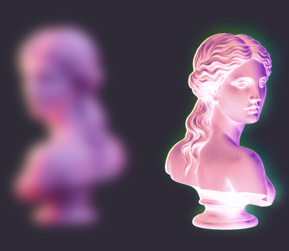</a> [code](https://github.com/maiatoday/vapor/blob/62643066a19564a06507ef86a399aead1527994e/src/main/kotlin/utils/ImageFromPath.kt#L28)         | Image with a BitmapPainter, ColorFilter, colorMatrix, blur,                                                                                                                                                                        | The choice of pngs, dolphins and old tech cassettes. Greek sculptures to remind us of beauty ideals. Having these elements floating makes them look surreal. Using blur and color filters changes what the look like to simulate old VHS errors. Remembering past technology imperfectly. Human and digital memory is fallable. |
| <a href="https://github.com/maiatoday/vapor/blob/62643066a19564a06507ef86a399aead1527994e/src/main/kotlin/aesthetic/Sunset.kt#L25">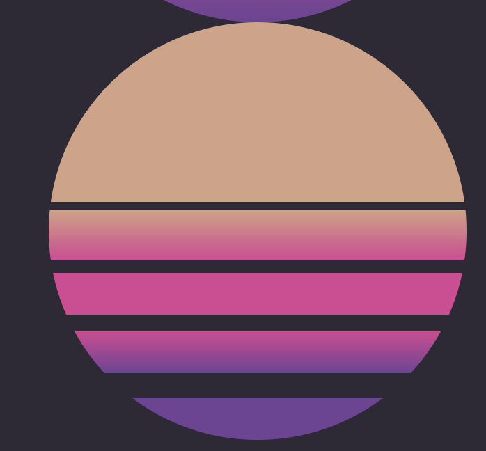</a>[code](https://github.com/maiatoday/vapor/blob/62643066a19564a06507ef86a399aead1527994e/src/main/kotlin/aesthetic/Sunset.kt#L25)                        | drawCircle filled with gradients with color stops and Color.Transparent                                                                                                                                                            | a retro sunset in a perfect world remembered imperfectly                                                                                                                                                                                                                                                                        |
| <a href="https://github.com/maiatoday/vapor/blob/62643066a19564a06507ef86a399aead1527994e/src/main/kotlin/aesthetic/NeonPalm.kt#L20">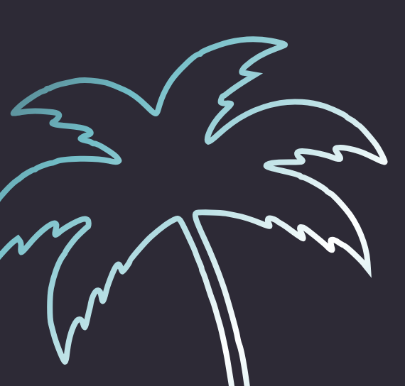</a> [code](https://github.com/maiatoday/vapor/blob/62643066a19564a06507ef86a399aead1527994e/src/main/kotlin/aesthetic/NeonPalm.kt#L20)                       | svg string converted to Path, transformation matrix to [convert from original points](https://github.com/maiatoday/vapor/blob/62643066a19564a06507ef86a399aead1527994e/src/main/kotlin/utils/ScribblePath.kt#L7) to new composable | references to idealised worlds of palm trees. Unreleastic and rendered in Neon                                                                                                                                                                                                                                                  |
| <a href="https://github.com/maiatoday/vapor/blob/62643066a19564a06507ef86a399aead1527994e/src/main/kotlin/aesthetic/MeshGradient.kt#L15"></a>  [code](https://github.com/maiatoday/vapor/blob/62643066a19564a06507ef86a399aead1527994e/src/main/kotlin/aesthetic/MeshGradient.kt#L15)              | [mesh gradient by sinasamaki](https://gist.github.com/sinasamaki/05725557c945c5329fdba4a3494aaecb)                                                                                                                                 | pastel colors dreamy, sureal, floaty, very vaporwave                                                                                                                                                                                                                                                                            |
| <a href="https://github.com/maiatoday/vapor/blob/62643066a19564a06507ef86a399aead1527994e/src/main/kotlin/utils/GlitchShader.kt#L110">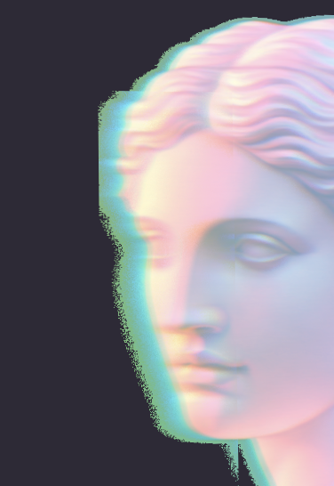</a> [code](https://github.com/maiatoday/vapor/blob/62643066a19564a06507ef86a399aead1527994e/src/main/kotlin/utils/GlitchShader.kt#L110)                 | Skia Shader language, RuntimeShader, composeRenderEffect in a modifier                                                                                                                                                             | digital artefacts degrade, bitrot and imperfect memories, glitches and remixes                                                                                                                                                                                                                                                  |

### Fonts and Colours
Pick some colours, not too many and stick with them. Pick some fonts, not too many and stick with them. I chose pastels for a dreamy, hazy vibe. There needs to be a pink and a teal, in my case Mulberry and RobinEggBlue.

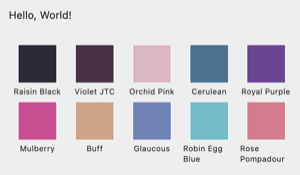

The fonts were retro, reminiscent of arcade games but also glitched and damaged because digital artefacts degrade, nothing is immune to bitrot. The fonts are found on [Google Fonts](https://fonts.google.com/)

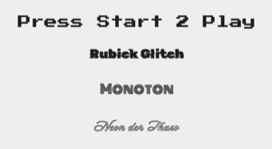

*Let's dig into a few of the details, shall we?*

### Vanishing Floor
 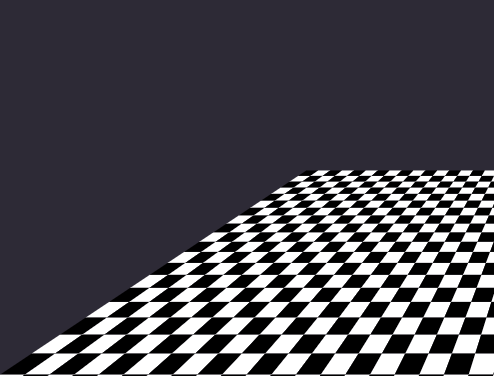

To get the ghostly magenta grid or the black and white tiling my inital prompt had Junie just drawing a bunch of squares. Not what I wanted at all because as you will notice the squares are slanted because of the one point perspective. With a bit of research I found a way to do a [projection](https://github.com/maiatoday/vapor/blob/main/docs/look/perspective.md). So each point that starts a line or is a corner of a tile is converted into a point projected onto the canvas. The same projection [function](https://github.com/maiatoday/vapor/blob/62643066a19564a06507ef86a399aead1527994e/src/main/kotlin/aesthetic/VanishingFloor.kt#L67) can be used whether we are drawing squares or lines. More [info](https://www.youtube.com/watch?v=KessaP_Fu10) on one point perspective

### Cassettes, dolphins, statues and color shifts
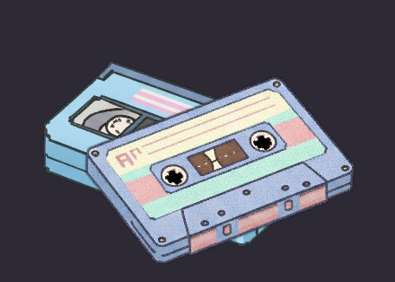 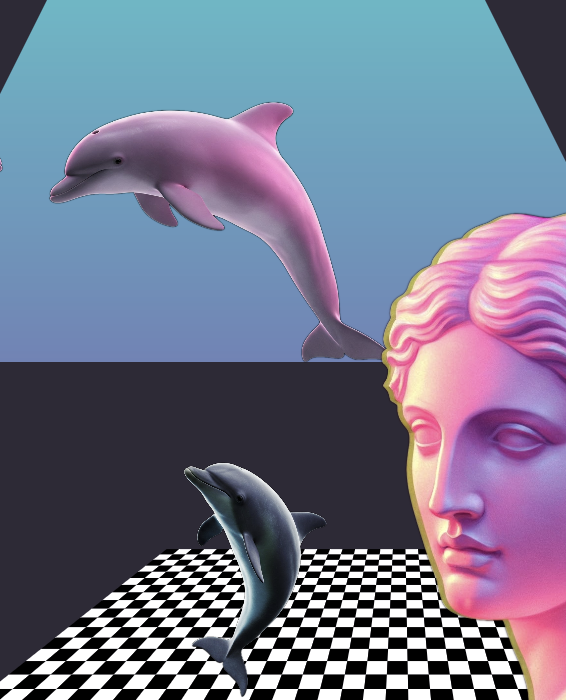

A selection of pngs. This is nothing new. What makes this part interesting is you can apply a filter to the image to modify any of the color or alpha channel. How it works is you provide a matrix of values. This matrix will then be applied to each pixel.

The matrix looks like this:
```
[ a, b, c, d, e,
  f, g, h, i, j,
  k, l, m, n, o,
  p, q, r, s, t ]
```

If you take a color `[R, G, B, A]` and apply the matrix you get this

```
R' = a*R + b*G + c*B + d*A + e
G' = f*R + g*G + h*B + i*A + j
B' = k*R + l*G + m*B + n*A + o
A' = p*R + q*G + r*B + s*A + t
```

A matrix that inverse the image looks like this:

```
[ -1, 0, 0, 0, 255,
  0, -1, 0, 0, 255,
  0, 0, -1, 0, 255,
  0, 0, 0, 1, 0 ]
```

This matrix gives a lot of power to change the original image.

We can also add a blur modifier and flip the images horizontally or vertically. Horizontal or vertical flip is achieved by adjusting the scale.

More in the [official docs](https://developer.android.com/reference/kotlin/androidx/compose/ui/graphics/ColorMatrix).

### Sunset


The clue to the retro sunset is in a combination of gradients with color stops and using Color.Transparent.

```kotlin
val brushRetro = Brush.verticalGradient(
            colorStops = arrayOf(
                0.0f to topColor,
                0.43f to topColor,
                0.43f to Color.Transparent,
                0.45f to Color.Transparent,
                0.45f to topColor,
                0.57f to middleColor,
                0.57f to Color.Transparent,
                0.6f to Color.Transparent,
                0.6f to middleColor,
                0.7f to middleColor,
                0.7f to Color.Transparent,
                0.74f to Color.Transparent,
                0.74f to middleColor,
                0.84f to bottomColor,
                0.84f to Color.Transparent,
                0.9f to Color.Transparent,
                0.9f to bottomColor,
                1.0f to bottomColor
            ),
            startY = 0f,
            endY = height
        )
```

### Palm tree svg


It is possible to extract the points of a s simple svg. Looking at the sample [palm tree file](p3.svg) find the following line.

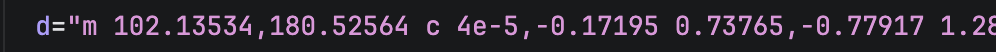

Copy the string into the code and convert it to a Path. The problem is the points are relative to the coordinate system and size of the svg image and not the resulting composable view. It needs to be transformed. The conversion is based on the original path and the destination composable.

The conversion code looks like this

```kotlin
fun fromBoundsToComposeView(
    bounds: Rect = Rect(-1f, -1f, 1f, 1f),
    width: Float,
    height: Float
): Matrix {
    val originalWidth = bounds.right - bounds.left
    val originalHeight = bounds.bottom - bounds.top
    val scale = min(width / originalWidth, height / originalHeight)
    val newLeft = bounds.left - (width / scale - originalWidth) / 2
    val newTop = bounds.top - (height / scale - originalHeight) / 2
    val matrix = Matrix()
    matrix.translate(-newLeft, -newTop)
    matrix.scale(scale, scale)
    return matrix
}
```

Apply the resulting matrix to the image. `path.transform(matrix)`

### Mesh Gradient


There is a really useful [mesh gradient modifier](https://gist.github.com/sinasamaki/05725557c945c5329fdba4a3494aaecb) created by sinasmaki with a great [writeup](https://www.sinasamaki.com/mesh-gradients-in-jetpack-compose/) on how it works. Hot reload is useful for tuning the colors of the gradients. There is also a [visual tool](https://github.com/c5inco/Mesh) to set the gradient up.

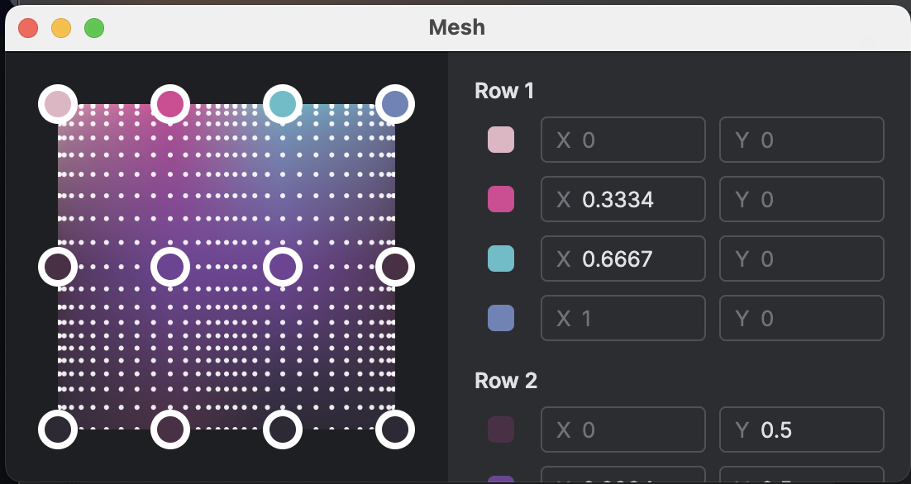

### Glitches


It is possible to use [Skia Shaders](https://skia.org/docs/user/sksl/) with Compose. The setup is easy enough and the shader is copied into a string. I found a [small glitch shader](https://www.shadertoy.com/view/4dXBW2) on ShaderToy. Integration is [straight forward](https://github.com/maiatoday/vapor/blob/62643066a19564a06507ef86a399aead1527994e/src/main/kotlin/utils/GlitchShader.kt#L126) by creating a runtime Shader. Understanding shader code is something else entirely. Hot reload is a useful tool to test and experiment with shaders to learn how they work. [This playlist](https://www.youtube.com/playlist?list=PLGmrMu-IwbguU_nY2egTFmlg691DN7uE5), on learning how to build shaders on ShaderTo,y is a good resource to get started.

## Enter the AIs
Of course I had help - [Junie](https://www.jetbrains.com/junie/) and [AI assistent](https://www.jetbrains.com/ai-assistant/) as well as [Gemini](https://gemini.google.com/app) for research.

### Research with Gemini
To orient me and to be sure I understood vaporwave, Gemini did a deep research [report](https://github.com/maiatoday/vapor/blob/main/docs/vaporwave.md) on the topic for me.

### Plans and execution with Junie

1. make a list of *compose techniques* to explore
2. make a list of [vaporwave aesthetic elements](https://github.com/maiatoday/vapor/blob/main/docs/look/aesthetics.md)
3. create a [readme](https://github.com/maiatoday/vapor/blob/main/README.md) and a [guidelines](https://github.com/maiatoday/vapor/blob/main/.junie/guidelines.md) file
4. collect visual references, blog posts with code snippets, bitmaps, images, fonts and colours in a [docs folder](https://github.com/maiatoday/vapor/blob/main/docs/look)
5. take each of the aesthetic elements and ask Junie to *build* one sample element and use it in a specific composable e.g.
    ```Build an equilateral triangle composable that draws on the Canvas and uses a gradient brush. Show and example of this composable in the SoloTriangle composable```
6. Commit and tag goto step 5

I didn't let Junie just do the whole list. I prompted each element separately so that I could check it out and tweak it before I commited and tagged. I also started a fresh context and a new task for each step. This worked well because the `guidelines.md` and `docs/look` folder kept the continuity.

### Inbetween questions with AI assistant
While Junie was busy building things, I would use the AI assistant to research info for the next thing I wanted to build with oneshot questions. e.g.
    ```
    How do I draw a perspective grid that has a single vanishing point on a flat surface
    ```
This resulted in some python code. I asked it to [explain](https://github.com/maiatoday/vapor/blob/main/docs/look/perspective.md) the python code. This was useful because it didn't interfere with what Junie was doing. In my subsequent prompt to Junie, I asked it to use the research I captured in a markdown file.

### Understanding everything with DeepWiki

For more detailed understanding of the whole project I fed it to [DeepWiki](https://deepwiki.com/maiatoday/vapor). This helped to make sense of some opaque parts such as the [glitch shader code](https://deepwiki.com/maiatoday/vapor/5.2-glitch-effect).

## All the things

The final composition of all the pieces is a quick and dirty `Box` or two with everything inside.

A fun way to showcase hot reload is to run the app, in my case `./gradlew runHot --mainClass MainKt --auto`. Then in a separate terminal run the [speedrun](https://github.com/maiatoday/vapor/blob/main/speedrun.kts) script. This script checks out the next tag in a series of git tags when you type enter in the terminal. Because the app is running auto updating hot reload, the changes appear progressively.

Tada!
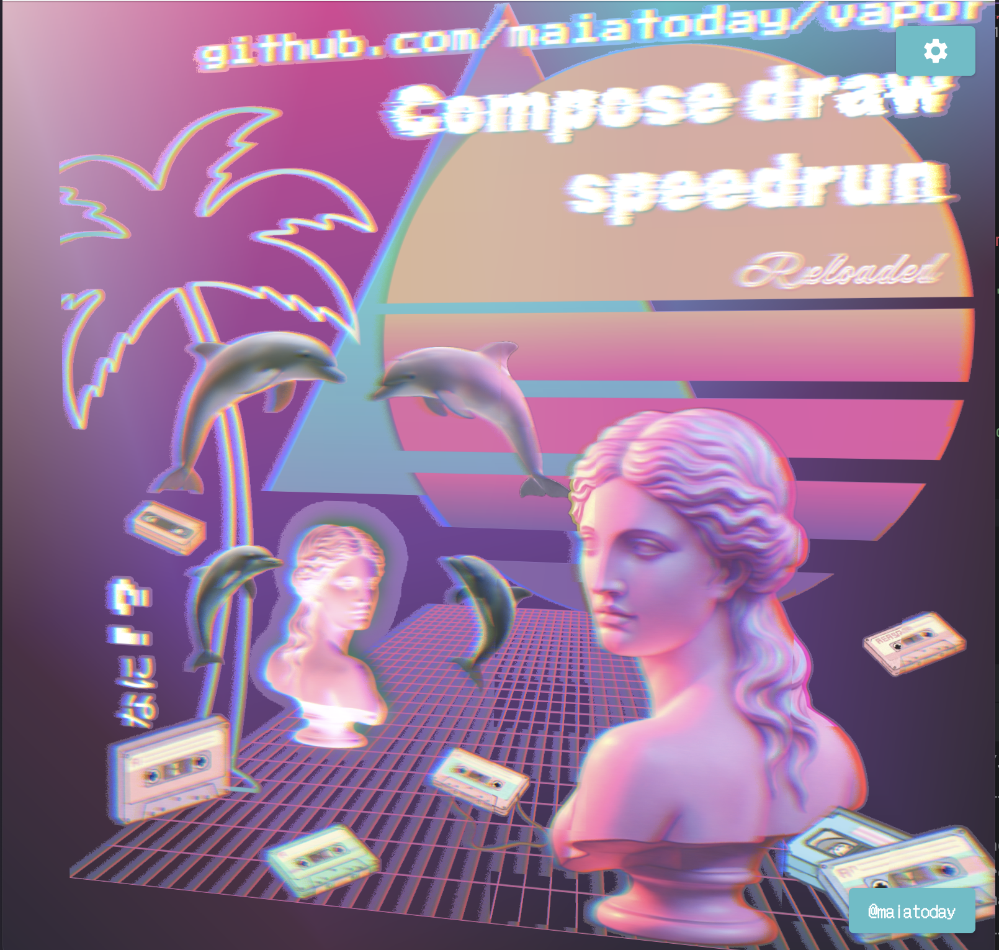

Live demo video coming to a browser near you soon.
