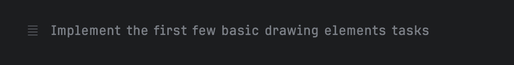

Sunday afternoon. Perfect time to hang out with [Junie](https://www.jetbrains.com/junie/). I want to refresh my memory on some Compose drawing techniques. I am not really in the mood for Googling. I don't need a production read app. I really just want mess around. How far can I [vibe code](https://x.com/karpathy/status/1886192184808149383) this. I'll start off by setting Junie to brave mode.


I added an image and some colours to the repo of a blank compose desktop project. I also put a copy of an [older blogpost](https://www.maiatoday.net/p/how-to-build-wrapped-2023-in-compose-animation/) of mine with some drawing techniques. I set some ground rules with the first prompt and then just keep asking Junie to add things.

```
Create a guidelines file with the following information and update the README.md file.
Let's explore some visual techniques in this Kotlin multiplatform project. The aim is to go for variety of techniques. Feel free to use the canvas, brush, paint, gradient, lines, paths, rounded polygons, skia shaders, text, colours, shapes. Or anything that will create an interesting visual effect. Animations are not necessary but can be added. The project does not have a practical application other than to demonstrate how to create interesting visual elements and to have some fun. It is a visual tribute to the Studio Ghibli film, [My Neighbor Totoro](https://en.wikipedia.org/wiki/My_Neighbor_Totoro).
* It does not need any tests
* Layer all the visual techniques on the main composable screen.
* Find the suggested fonts in the resources folder
* Find inspiration in the docs/looks folder and in the docs/blogpost folder

```
I think Junie [got](https://github.com/maiatoday/playdate/blob/main/GUIDELINES.md) what I wanted to do, I never explained what Totoro looks like but it figured out something from the included inspiration image.

The early experiments needed some tweaking


The only time the project didn't run was when Junie didn't download the new fonts but I found the instructions on where to get the fonts added to the README.md. I had no real expectations so I'm pretty happy with the final result. Animating rain and clickable wobbling Totoro.

No explanations really what can I say I didn't read the code 🙈, but you [can](https://github.com/maiatoday/playdate/tree/main). I can't vouch for the conciseness nor the elegance. I'll just post a selection of prompts and the final result.



<video width=60% controls autoplay>
    <source src="totorotribute.webm" type="video/webm">
    Your browser does not support the video tag.
</video>







