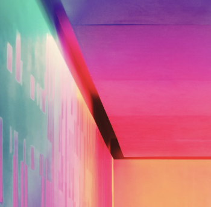
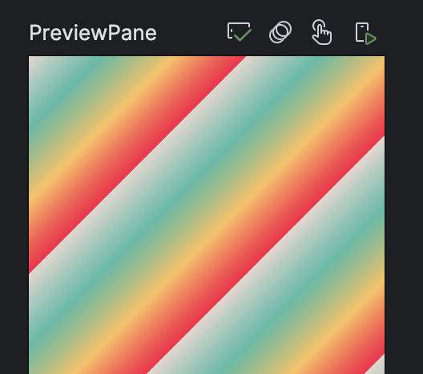
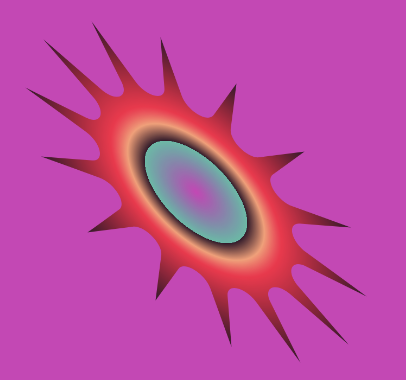
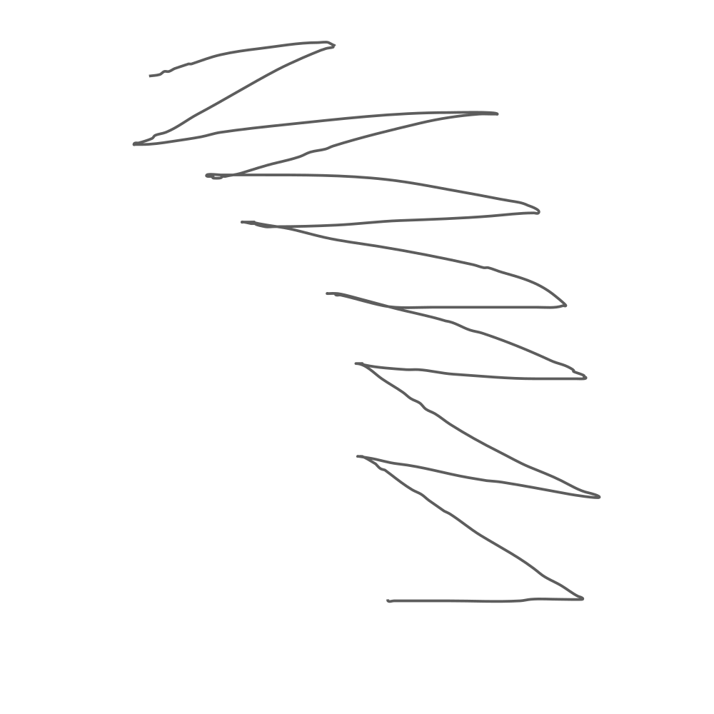
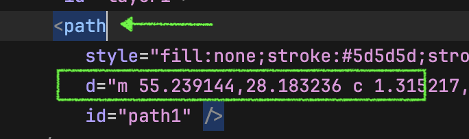
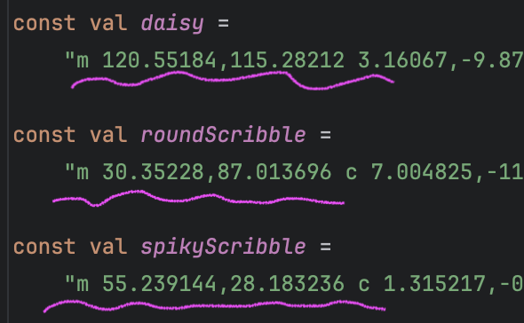
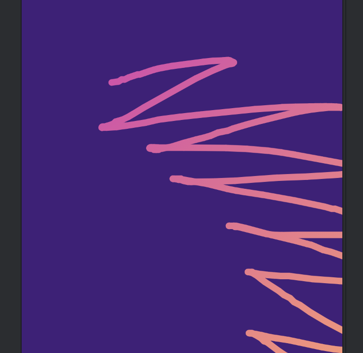
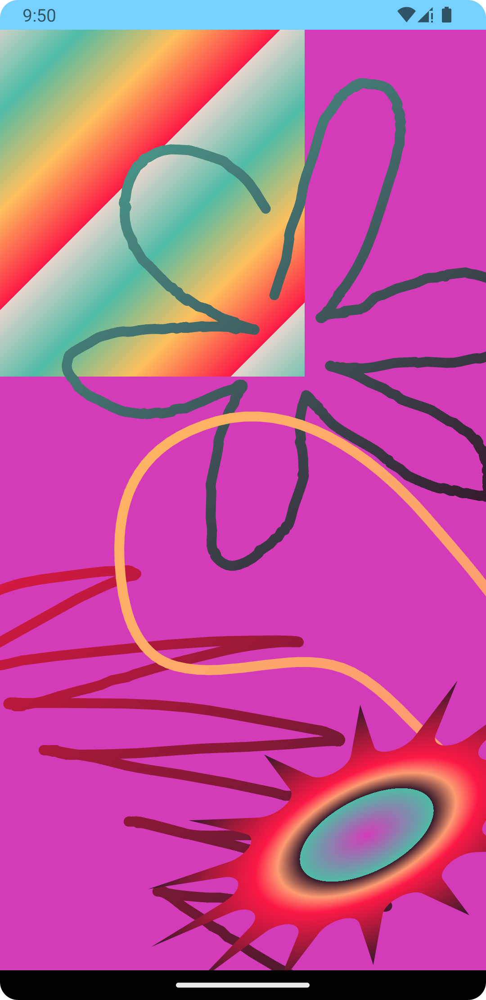

# How to build Wrapped 2023 in Compose Animation

If I had to build the [Spotify Wrapped 2023](https://open.spotify.com/wrapped/share/share-991bdbcda37a462bac4c6d6c80b17ef0-1080x1920?lang=en&destination=datastories&si=MDUyMGY4ZTAtYmRmMS00ZjJhLWE3OGItNjFhNzBmMzAwYzBk) animations in Compose, this is how I would do it. This blog post doesn't reproduce the effects identically, but it shows some of the basic Compose animation techniques you could use. It uses `Canvas` drawing and especially the `drawWithCache` modifier. It also uses `RoundedPolygon`, various matrix transformations and looping animation techniques using `infiniteRepeatable`. There is a section about how to get a path from an svg file as well.

I created three different techniques. The first is a simple box with an animating linear gradient and an animating offset. The second is a spiky star using a `RoundedPolygon` with colour stop gradient and some animations in a `graphicsLayer`. The last is a progressivly drawing line. As a bonus we'll make a palette using [unsplash.com](https://unsplash.com/) and [coolors.co](https://coolors.co/palettes/popular) Let's start with the palette.

## Pick a palette



Pick an image from unsplash and pull some colours from the image. [Here's one](https://unsplash.com/photos/multicolored-hallway-RnCPiXixooY) I got. I then loaded it into [coolors.co](https://coolors.co/palettes/popular) and picked some palette colours from the image.

Here are the colours I picked:
```kotlin
val Pasta = Color(0xFFE7D6CE)
val OrangeSquash = Color(0xFFFD9B72)
val Plumberry = Color(0xFF682084)
val Aubergette = Color(0xFF421F7B)
val SwimmingCap = Color(0xFF4FBBA5)
val Cherry = Color(0xFFFC1946)
val Sherbet = Color(0xFFD33BB9)
val Licorice = Color(0xFF35192B)
val Custard = Color(0xFFFEC05D)
```
We can now use these everywhere as gradients or backgrounds and our animation will have a consistent look that matches the mood from the image.

## Shimer pane - animating Linear Gradient



For this sliding box we animate the offset with an `infiniteRepeatable` and we animate the offset of the `LinearGradient`. The colors of the gradient are chosen from the colors of our newly created palette. The linear gradient changes colour from corner to corner. By changeing the offset of the gradient it moves the gradient in the shape. If we then animate this offset it will make the colours move across the shape. The second animation is simply an x offset to slide the box in and out. You can look at the complete [ShimmerPane function](https://github.com/maiatoday/turbo-giggle/blob/main/app/src/main/java/net/maiatoday/turbogiggle/ShimmerPane.kt) in the repo. This linear gradient trick is explained in detail in [this blog post](https://medium.com/androiddevelopers/brushing-up-on-compose-text-coloring-84d7d70dd8fa).

In the code snippet you can see how the linear gradient brush is created in the `drawWithCache` modifier and then the actual drawing happens in the lambda parameter of the `onDrawBehind` function.

```kotlin
Spacer(modifier
.offset(200.dp*slideIn, 0.dp)
.drawWithCache {
    val brush = Brush.linearGradient(
    colors = paneColors,
    start = Offset(offset, offset),
    end = Offset(offset + deltaPx, offset + deltaPx),
    tileMode = TileMode.Repeated
    )
    onDrawBehind {
        drawRect(brush = brush, style = Fill)
    }

})
```

## Spiky Splash - rotating RoundedPolygon with drawWithCache modifier



The Spiky Splash shape is created with a RoundedPolygon with 14 vertices.

```kotlin
val spikySplash = RoundedPolygon.star(
    numVerticesPerRadius = 14,
    innerRadius = 0.4f,
    innerRounding = CornerRounding(radius = 0.1f)
)
```
The trick with the RoundedPolygon is that it is created in a canonical rectangle that ranges from -1 to 1 both the x and the y axis. To be able to see it we need to transform it. Also the transformation needs to happen using the Android View Matrix, not the Compose matrix. The transformation looks like this:

```kotlin
fun fromBoundsToView(
bounds: RectF = RectF(-1f, -1f, 1f, 1f),
width: Float,
height: Float
): Matrix {
    val originalWidth = bounds.right - bounds.left
    val originalHeight = bounds.bottom - bounds.top
    val scale = min(width / originalWidth, height / originalHeight)
    val newLeft = bounds.left - (width / scale - originalWidth) / 2
    val newTop = bounds.top - (height / scale - originalHeight) / 2
    val matrix = Matrix()
    matrix.setTranslate(-newLeft, -newTop)
    matrix.postScale(scale, scale)
    return matrix
}
```
This matrix can be used to transform the RoundedPolygon into the hosting view. When we draw this polygon we need to first transform it with the matrix and then convert it to a compose path. The transformation happens in the `drawWithCache` modifier so that it is cached.

Here is just the `drawWithCache` modifier:

```kotlin
.drawWithCache {
    val matrix = fromBoundsToView(width = size.width, height = size.height)
    val sizedSpikySplash = RoundedPolygon(spikySplash).apply { transform(matrix) }
    val spikyBrush = Brush.radialGradient(colorStops = colorStops)
    onDrawBehind {
        drawPath(
        path = sizedSpikySplash
        .toPath()
        .asComposePath(),
        brush = spikyBrush
        )
    }
}
```

It is coloured with a radial gradient with stops so that the colours make more distinct bands. Full [spiky splash source here](https://github.com/maiatoday/turbo-giggle/blob/main/app/src/main/java/net/maiatoday/turbogiggle/SpikySplash.kt)

The animation is pretty standard, `infiniteTransition` changing then rotation angle.
```kotlin
val spikyTransition = rememberInfiniteTransition(label = "spiky transition")
val rotate by spikyTransition.animateFloat(
    initialValue = 45f,
    targetValue = -45f,
    animationSpec = infiniteRepeatable(
        animation = tween(4_000, easing = FastOutSlowInEasing),
        repeatMode = RepeatMode.Reverse
    ),
    label = "Spiky rotate "
)
```
We use the rotation angle in a `graphicsLayer` modifier because we don't need to redraw the spiky splash, we only need to rotate it. We also change the shape to be more oval in this snippet by scaling it to half the size in the y axis.

```kotlin
.graphicsLayer {
  scaleY = 0.5f
  rotationZ = rotate
}
```

## Scribble drawing - path, matrix transform, flattened path

### How to get a path from svg



Create some scribbles in a package like inkscape or any drawing package that will let you save an svg. Don't make it complicated, literally just draw a line with the pencil. Then open the svg with a text editor. You can [open](http://maiatoday.net/p/how-to-build-wrapped-2023-in-compose-animation/spikyscribble.svg) the svg displayed here and see what it looks like. You are looking for a line that starts with something like `<path style="fill:none;...`



Copy everything in the `d="...` section as a string and paste it into your code.



### Transforming the path with the matrix

The matrix transformation is [very similar](https://github.com/maiatoday/turbo-giggle/blob/2849314e0e2fb1e4670e500759c4fe7ff994a87b/app/src/main/java/net/maiatoday/turbogiggle/ScribblePath.kt#L164) to the RoundedPolygon one, but... we now need the Compose `Matrix` not the Android view one. Also the bounds of the path are no longer -1,1 for both x and y. We can get the bounds of the path and use it to make a matrix to size the scribble to fit the view. 

### Drawing the path

If we just draw the path as is, it will draw the whole path and not progressively draw it. There is a neat trick as shown in [this video at timestamp 31:36](https://youtu.be/2zVBnJ15C6M?si=GWK1N7W9waBtchKM&t=1884). 

### Scribble draw the path with flattened lines

The clue is we split the whole path up into short sections, little lines, which we draw one after the other. The line of code where this happens is

```kotlin
val lines = path.asAndroidPath().flatten(0.5f)
```
The 0.5f parameter in the flatten call is the error that the flatten call allows, 0.5 is half a pixel. You can also see we need to convert again to an `AndroidPath` because the `flatten` method is only available on Android paths. We animate a progress variable so we can loop from say 0% to 10% and so on up to 100% and then start again. Then in the modifier `onDrawBehind` function lambde we loop through the `lines` and draw only those lines up to a the progress variable. The animation is caused by only some of the path subsections being drawn and more and more of them being drawn as the progerss increases.




## Combining everything



Since these different elements are all built in their own composable. We can put them all together remembering that the `Composables` that are drawn first will be at the bottom.

```kotlin
@Composable
fun Giggle(modifier: Modifier = Modifier) {
    Box(modifier.background(Sherbet)) {

        ShimmerPane(
          Modifier
            .height(280.dp)
            .width(250.dp)
        )
        Daisy(colors = listOf(SwimmingCap, Licorice))
        SpikyScribble(
          colors = listOf(Cherry, Licorice),
          modifier = Modifier
            .offset(-150.dp, 400.dp)
        )
        Bean(colors = listOf(Custard, OrangeSquash),
          modifier = Modifier
            .fillMaxSize()
        )
        SpikySplash(
          Modifier
            .size(500.dp)
            .offset(100.dp, 400.dp)
        )
    }
}

```

## That's a wrap

Here's [the repo](https://github.com/maiatoday/turbo-giggle)

and here's the demo

 

<video width=25% controls autoplay>
    <source src="wrapped.webm" type="video/webm">
    Your browser does not support the video tag.  
</video>



## What's next

This experiment is by no means complete. This is what I could try out next:
* Figure out **what is up with the scribble line transform** that makes it sometimes cut off at the bottom
* Make the scribble lines more like the real thing by figuring out how to **make the gradient draw along the line**
* Figure out a way to do the **blocky scribble**
* Draw some **album art** and add text
* Make a **circular calendar** with a bezier or RoundedPolygon animating graph
* Make **sliding in blinds** effect
* **Get real data** from the Spotify API and expand the animations

But hey, there is always more to learn and explore.

If you want to get a step by step walkthrough of concepts such as these with some theory discussions and a practise repo, check out my droidcon academy coffee break codelab titled [Draw and Animate on Canvas with Jetpack Compose in Android](https://academy.droidcon.com/course/draw-and-animate-on-canvas-with-jetpack-compose-in-android)

## References

[Alejandra's  Medium article on animating linear gradient brush](https://medium.com/androiddevelopers/brushing-up-on-compose-text-coloring-84d7d70dd8fa)

[Chet's article on Rounded Polygons](https://medium.com/androiddevelopers/the-shape-of-things-to-come-1c7663d9dbc0)

[Rebecca's video on drawing text as a flattened path and more](https://www.youtube.com/watch?v=2zVBnJ15C6M)

[Rebecca's gist for the scribble lines](https://gist.github.com/riggaroo/4c6abc7d29e511831c2ceb68697b913f#gistcomment-4375902)


